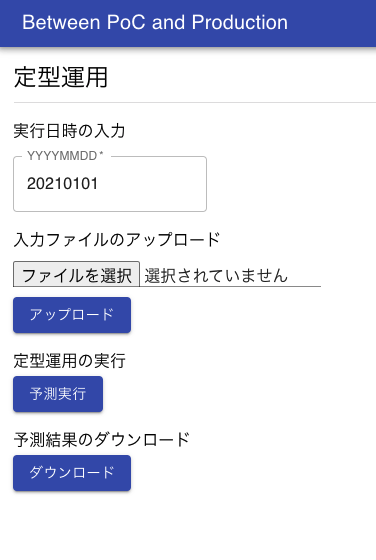

# 機械学習 PoC と本番運用のあいだ

## はじめに

機械学習を使った PoC(Proof of Concept; 効果検証)は、近頃の AI ブームを受けて盛んに行われていることと思います。そしてその後、(とても幸運なことに、)PoC で良い結果を得られた場合、PoC の仕組みを本番運用したいという話が持ち上がります。しかしながら、探索的データ分析や予測モデルの作成などは多くの知見が共有されている一方、それらを運用していくための知見はまだあまり多くないように思います。

本記事では、PoC から本番運用へと移行するあいだに、技術的には何が必要なのかを検討していきます。機械学習 PoC が一過性のまま終わらず、本番運用によって価値を生み出していくための一助となれば幸いです。

### 本記事で書くこと

- PoC におけるデータ分析の進め方
- **機械学習 PoC のテスト運用の進め方(本記事のメイントピック)**
- **PoC、テスト運用の各フェーズでのアーキテクチャ(本記事のメイントピック)**
- 本番運用に向けて追加で検討すべきこと

本記事では特にテスト運用にフォーカスして書いていきます。テスト運用では運用と分析を並列で行うことが多いですが、運用と分析を両立しながら、どのようにシステムのアーキテクチャをアップデートしていくかの一例を記載します。

### 本記事で書かないこと

- 機械学習モデルの予測精度向上に関する詳細
  - 探索的データ分析の詳細
  - 前処理や特徴量生成の詳細
  - 予測モデルの詳細
- ミドルウェア(データベースや Web サーバ)よりも低レイヤーに関して
- 機械学習 PoC でのコンサルテーションに関するスキル

コンサルテーションに関するスキルは、不確実なことの多い機械学習プロジェクトにおいて大変重要な点ですが、本記事では技術にフォーカスするため記載しません。

### 本記事で想定するシステム

- 数 GB〜数十 GB の比較的小規模なデータを利用する
  - 数億レコード級のデータではなく、メモリに載るサイズのデータを扱う
- バッチ学習、バッチ推論を行う
  - オンライン(リアルタイム)での学習・推論は行わない
- システム構築はデータ分析と並行して進める
  - 作るべきものは決まっておらず、走りながら必要に応じて作っていく

### 本記事で利用するデータ

本記事では、Kaggle で過去に開催されたコンペティションである「[Home Credit Default Risk](https://www.kaggle.com/c/home-credit-default-risk/data)」のデータを利用します。このコンペティションは個人の与信情報をもとに、各個人が債務不履行になるかどうかを予測するものです。データにはローンの申込みごとにレコードがあり、1 つのレコードには申込者の与信に関する情報と、その人が返済できたか、あるいは債務不履行になったかを示すラベルが含まれています。

この記事では、自分がとあるローン貸付会社のデータ分析部門にいることを想定します。この与信情報をもとに、与信判定を機械学習を用いて自動化するとしたらどうするか、という仮定のもとで話を進めていきます。

説明の都合上、この仮定の上で、本コンペティションで利用できるデータのうち、「application_train.csv」を図のように分割して利用します。分割したデータはそれぞれ以下を仮定して使用します。

- 「initial.csv」：過去の与信情報。PoC で利用する
- 「20201001.csv」：2020 年 10 月分の与信情報。テスト運用ではこのデータは「initial.csv」と合わせて訓練データとして扱う
- 「20201101.csv」：2020 年 11 月分の与信情報。テスト運用ではこのデータは「initial.csv」と合わせて訓練データとして扱う
- 「20201201.csv」：2020 年 12 月分の与信情報。テスト運用ではこのデータは「initial.csv」と合わせて訓練データとして扱う
- 「20210101.csv」：2021 年 1 月分の与信情報。テスト運用ではこの月から予測を始める


データを分割した実際のコードは以下です。

**split_data.ipynb**

```python
# データ読み込み
train = pd.read_csv('../data/rawdata/application_train.csv')

# initial.csv出力
train.iloc[:len(train)-40000,:].to_csv('../data/poc/initial.csv', index=False)

# 各月データ出力
train.iloc[len(train)-40000:len(train)-30000,:].to_csv('../data/poc/20201001.csv', index=False)
train.iloc[len(train)-30000:len(train)-20000,:].to_csv('../data/poc/20201101.csv', index=False)
train.iloc[len(train)-20000:len(train)-10000,:].to_csv('../data/poc/20201201.csv', index=False)
train.iloc[len(train)-10000:,:].to_csv('../data/poc/20210101.csv', index=False)
```

### 検討に際して想定する状況

本記事では、説明をしやすくするため、以下のようなプロジェクトを想定して検討を進めていきます。以降のストーリーは、今回使用する「Home Credit Default Risk」のデータから筆者が妄想したものであるため、現実の会社や業務とは全く無関係です。また、筆者は与信業務に関して全くの素人であり、現実の業務と異なる可能性が大いにあります。

---

自分はデータサイエンティストとして、銀行の与信判定業務を自動化するプロジェクトに参画している。
与信判定業務は審査部門にて人手で行われているが、工数の低減や与信判定の精度向上のために機械学習が使えないか検討している。
サンプルデータはすでに提供されており、PoC を行う段階にある。サンプルデータは過去にローンを貸りた人が債務不履行になったかどうかが記録されている。このデータをもとに、もし新しくローンを借りたい人がいたときに、その人が債務不履行になるかどうかを予測することで、ローンを貸し付けるかどうかの判定ができるようにしたい。

### 本記事の対象とするプロジェクトのスコープ

機械学習プロジェクトは通常、企画、PoC、テスト運用、本番運用と続いていきます。本記事では、技術的なポイントにフォーカスするため、PoC からテスト運用までをスコープとして記載します。特にテスト運用については、本番運用に移行するために多くの検証が必要になるため、3 つのフェーズに分けて説明します。なお本番運用については、筆者の経験が浅いため、検討すべき点を挙げるだけに留めています。


### 本記事で想定する体制

本記事では、プロジェクトをスモールスタートで進めていく方針で記載するため、ミニマムな体制を想定します。具体的には、ビジネス部門(本記事では与信審査部門)とやり取りをするコンサルタントが 1 名、データ分析からシステム構築までを行うデータサイエンティストが 1 名になります。実際には、監督としてマネージャーがいると思いますが、本記事では登場しません。またステークホルダーとしては、ビジネス部門が存在します。


## PoC フェーズ

### このフェーズでの目的

このフェーズの目的は、与信判定の自動化が可能なのかを検証することです。本フェーズでは主に 2 つのポイントについて検証していきます。1 つは、 1 つは利用するデータが本番運用時にも利用できるものであるか(予測時に利用可能なデータなのか、レコード同士に関連性がないか)というデータの妥当性の検証、もう1つは機械学習によって与信判定はどれくらいの精度で予測できるのかという予測精度の検証です。

### このフェーズでのアーキテクチャ

このフェーズでは JupyterLab だけで作業を進めていきます。機械学習モデルの保存のために MLflow を記載していますが、(個人的には)最初期には必要ないと思っています。


### データの妥当性検証

データサイエンティストとしてはすぐにでもデータを見始めたいところですが、まずはそのデータの妥当性を検証します。もしデータに欠陥があれば、そのデータを利用した予測は無駄になってしまう可能性が高いからです。妥当性の検証では、主に 2 つのポイントを確かめます。1 つは、各レコードにおいて、レコード内のそれぞれの列のデータはいつ入手できるのかを明らかにすることです。各列のデータは、こちらに提供された時点では揃っているように思えますが、それらが同時に入手できるとは限りません。最も簡単な例では、目的変数である「債務不履行に陥ったかどうか」が分かるのは、他の列より後になるでしょう。もう 1 つの確認ポイントは、レコード同士に関係がないかをチェックすることです。例えば、ある人物が 2 回ローンの申し込みをしたとして、学習データに 1 回目のレコードが、テストデータに 2 回目のレコードが存在してしまうと、予測に有利に働いてしまうことが予想できます。このような場合には、両方のレコードを、学習データまたはテストデータのどちらかに含めるようにするなどの処理をします。これらのポイント以外にも、そもそも各列のデータは何を意味しているのか、レコードの単位は何なのか(今回のデータでは人単位なのか、ローン申請単位なのか)などをビジネス部門からヒアリングして、データの定義を明確にしておくことも大切です。データの列ごとにこれらの確認ポイントをチェックする表を作成すると良いかもしれません。

### 探索的データ分析

データの妥当性が検証できたら、(あるいは妥当性の検証と並行して、)サンプルデータを可視化しながら、どのような列(特徴量)があるのかを[Jupyter Lab](https://github.com/jupyterlab/jupyterlab) を使って見ていきます。この作業によってデータを理解し、特徴量エンジニアリングやモデル選択時の参考にします。また、データに問題がないかを探すきっかけとしても有用です。

まずは列ごとに、データ型、欠損値の割合などを確認します。

**eda.ipynb**

```python
"""
各コードの実行結果は「>」以下に示します。
また、説明に不要と思われる一部の実行結果は、
「...」「省略」と記載して省略しています。
"""

# ライブラリ読み込み
import pandas as np

# データ読み込み
train = pd.read_csv('../../data/rawdata/application_train.csv')

# 概要
train.head()
>
省略

# 行数、列数
f"行:{len(train)} / 列:{len(train.columns)}"
>
'行:307511 / 列:122'

# データ型
train.dtypes
>
SK_ID_CURR                        int64
TARGET                            int64
NAME_CONTRACT_TYPE               object
...

# 欠損値の数と割合
for c in train.columns:
    print(f'{c}  数:{train[c].isnull().sum()} / 割合:{train[c].isnull().sum() / len(train) * 100:0.4f}%')
>
SK_ID_CURR  数:0 / 割合:0.0%
...
NAME_TYPE_SUITE  数:1292 / 割合:0.4201%
...
COMMONAREA_AVG  数:214865 / 割合:69.8723%
...
```

次に分布を見るために、可視化をしてみます。
データ型が数値型の場合はヒストグラムを、文字列型の場合はバーチャートを使います。

**eda.ipynb**

```python
# ライブラリ読み込み
from bokeh.plotting import figure, output_file, show, output_notebook
from bokeh.models import ColumnDataSource, Grid, LinearAxis, Plot, VBar, HoverTool

# グラフをJupyterLab上で出力する設定
output_notebook()

# ヒストグラム
def plot_histogram(series, title, width=1000):
    p = figure(plot_width=width, plot_height=400, title=title, toolbar_location=None, tools="")
    hist, edges = np.histogram(series, density=True, bins=30)
    p.quad(
        top=hist,
        bottom=0,
        left=edges[:-1],
        right=edges[1:],
        fill_color="navy",
        alpha=0.2
    )
    p.y_range.start = 0
    show(p)

# バーチャート
def plot_bar_chart(series, title, width=1000):
    items = dict(series.value_counts())
    keys = list(items.keys())
    values = list(items.values())
    source = ColumnDataSource(data=dict(
    x=keys,
    y=values,
    ))
    TOOLTIPS = [
    ("列名", "@x"),
    ("カウント", "@y"),
    ]
    p = figure(plot_width=width, plot_height=400, x_range=keys, title=title,
               toolbar_location=None, tooltips=TOOLTIPS, tools="")
    glyph = VBar(x="x", top="y", width=0.9)
    p.add_glyph(source, glyph)
    p.xgrid.grid_line_color = None
    p.y_range.start = 0
    show(p)

# 列ごとにグラフを出力する。欠損値は「-999」で補完する
for c in train.columns:
    series = train[c].copy()
    if series.dtype == 'int64' or series.dtype == 'float64':
        series.fillna(-999, inplace=True)
        plot_histogram(series, c)
    else:
        series.fillna('-999', inplace=True)
        plot_bar_chart(series, c)
```

出力されたグラフのうち2つを例として記載します。実際は1つずつ分布を見ていきますが、今回は割愛します。

**AMT_CREDIT**


**NAME_INCOME_TYPE**


### 予測精度の検証

ここからは実際にモデルを作成して予測精度を検証します。精度検証の際に重要なのが評価指標ですが、今回は「Home Credit Default Risk」の評価指標と同じく ROC の AUC を使います。実際はビジネス部門と協議して、どの指標を使うのかをあらかじめ合意しておきます。まずは、マニュアルで予測モデルを作る前に、[PyCaret](https://github.com/pycaret/pycaret) を使ってざっくりと予測してみます。これにより、どの特徴量・モデルが有効なのかを比較し、実際にモデルを作る際の参考にします。

**eda.ipynb**

```python
# ライブラリ読み込み
from pycaret.classification import *

# セットアップ
exp = setup(data=train,
            target='TARGET',
            session_id=123,
            ignore_features = ['SK_ID_CURR'],
            log_experiment = True,
            experiment_name = 'credit1',
            n_jobs=-1,
            silent=True)
```

```python
# モデルごとの予測精度比較
models = compare_models(include=['lr', 'dt', 'rf', 'svm','lightgbm'],
                        sort='AUC')
```


今回は PyCaret がデフォルトで用意しているモデルのうち、以下をピックアップして比較しています。

- ロジスティック回帰
- 決定木
- ランダムフォレスト
- SVM
- LightGBM

評価指標を AUC とすると、LightGBM が優秀のようにみえます。一般に LightGBM は多くの場合精度と実行速度の両面で優秀であることが多いように思います。ところで、このデータでは正例が少ない不均衡データのため、Recall がどのモデルでも小さくなっています。ビジネス上のゴールにもよりますが、この後のモデル構築では、例えば Recall を上げて貸し倒れを防ぐモデルを作るなどします。本記事では、これ以上の詳細なモデリングは行わず、以降では LightGBM を使ってモデルを作成することとします。

次はどの特徴量が有効なのかを調べるため、PyCaret でモデルを LightGBM のモデルを作成し、評価します。

```python
# LightGBMモデル作成
lgbm = create_model('lightgbm')
```


```python
# モデルパラメータ詳細
evaluate_model(lgbm)
```


```python
# SHAP重要度算出
interpret_model(lgbm)
```


```python
# 重要度算出
importance = pd.DataFrame(models.feature_importances_, index=exp[0].columns, columns=['importance'])
importance.sort_values('importance', ascending=False)
```


今回のデータのように特徴量が多い場合、予測で使用する特徴量を絞ることでモデルの安定性を保てる可能性が高まります。絞り方の簡単な方法としては、特徴量重要度を算出し、重要度が低いものを除外することです。今回は単純に、重要度上位の特徴量を使用します。なお、PyCaret が自動で前処理している列については、オリジナルの方の列を使うことにします。

それでは、マニュアルで予測モデルを作成していきます。

#### 前処理

前処理としては、簡単のため、今回は欠損値の補完のみを行います。

**forecast.ipynb**

```python
# 欠損値補完
train.fillna(-999, inplace=True)
```

#### 特徴量エンジニアリング

特徴量エンジニアリングとしては、特徴量の選択とカテゴリ変数のダミー変数化を行います。

**forecast.ipynb**

```python
# 特徴量選択
features = [
    'EXT_SOURCE_1',
    'EXT_SOURCE_3',
    'EXT_SOURCE_2',
    'DAYS_BIRTH',
    'AMT_CREDIT',
    'AMT_ANNUITY',
    'DAYS_ID_PUBLISH',
    'AMT_GOODS_PRICE',
    'DAYS_REGISTRATION',
    'DAYS_LAST_PHONE_CHANGE',
    'AMT_INCOME_TOTAL',
    'REGION_POPULATION_RELATIVE',
    'OWN_CAR_AGE',
    'AMT_REQ_CREDIT_BUREAU_YEAR',
    'HOUR_APPR_PROCESS_START',
    'TOTALAREA_MODE',
    'CODE_GENDER',
    'NAME_CONTRACT_TYPE',
    'NAME_EDUCATION_TYPE',
    'NAME_FAMILY_STATUS',
    'TARGET'
]
train = train.loc[:,features]

# カテゴリ変数をダミー化
train = pd.get_dummies(train, drop_first=True, prefix=['CODE_GENDER', 'NAME_CONTRACT_TYPE', 'NAME_EDUCATION_TYPE', 'NAME_FAMILY_STATUS'], prefix_sep='_')
```

#### 予測

LightGBM を使ってモデルを作成します。また、[Optuna](https://github.com/optuna/optuna)を使ってハイパーパラメータのチューニングをします。

```python
# ラベルと特徴量を分離
target = 'TARGET'
X = train.drop(columns=target)
y = train[target]

# 訓練データとテストデータに分割
X_train, X_test, y_train, y_test = train_test_split(X, y,
                                                   test_size=0.2,
                                                   random_state=0,
                                                   stratify=y)

# 訓練データを一部バリデーション用に分割
X_train, X_eval, y_train, y_eval = train_test_split(X_train, y_train,
                                                    test_size=0.2,
                                                    random_state=1,
                                                    stratify=y_train)

# LightGBM用のデータセット作成
categorical_features = []
lgb_train = lgb.Dataset(X_train, y_train,
                       categorical_feature=categorical_features,
                        free_raw_data=False)
lgb_eval = lgb.Dataset(X_eval, y_eval, reference=lgb_train,
                       categorical_feature=categorical_features,
                       free_raw_data=False)

# パラメータチューニング
def objective(trial):

    param = {
        'objective': 'binary',
        'metric': 'auc',
        'verbosity': -1,
        'n_jobs': -1,
        'boosting_type': 'gbdt',
        'lambda_l1': trial.suggest_loguniform('lambda_l1', 1e-8, 10.0),
        'lambda_l2': trial.suggest_loguniform('lambda_l2', 1e-8, 10.0),
        'num_leaves': trial.suggest_int('num_leaves', 2, 256),
        'feature_fraction': trial.suggest_uniform('feature_fraction', 0.4, 1.0),
        'bagging_fraction': trial.suggest_uniform('bagging_fraction', 0.4, 1.0),
        'bagging_freq': trial.suggest_int('bagging_freq', 1, 7),
        'min_child_samples': trial.suggest_int('min_child_samples', 5, 100),
    }

    evaluation_results = {}
    model = lgb.train(
        param,
        lgb_train,
        num_boost_round=1000,
        valid_names=['train', 'valid'],
        valid_sets=[lgb_train, lgb_eval],
        evals_result=evaluation_results,
        categorical_feature=categorical_features,
        early_stopping_rounds=50,
        verbose_eval=10)

    y_pred = model.predict(X_train, num_iteration=model.best_iteration)

    # metrics AUC
    fpr, tpr, thresholds = metrics.roc_curve(y_train, y_pred)
    score = metrics.auc(fpr, tpr)

    return score

# Optunaでパラメータチューニング
study = optuna.create_study(direction='maximize')
study.optimize(objective, n_trials=10)

print('Number of finished trials: {}'.format(len(study.trials)))
print('Best trial:')
trial = study.best_trial
print('  Value: {}'.format(trial.value))
print('  Params: ')
for key, value in trial.params.items():
    print('    {}: {}'.format(key, value))
```

```python
# 二値分類
params = {
            'boosting_type': 'gbdt',
            'objective': 'binary',
            'metric': 'auc',
         }
# チューニングしたパラメータを合体
params = dict(params, **study.best_params)

# 学習
evaluation_results = {}
model = lgb.train(
    param,
    lgb_train,
    num_boost_round=1000,
    valid_names=['train', 'valid'],
    valid_sets=[lgb_train, lgb_eval],
    evals_result=evaluation_results,
    categorical_feature=categorical_features,
    early_stopping_rounds=50,
    verbose_eval=10)

# best_iterationを保存
optimum_boost_rounds = model.best_iteration
```

```python
# 訓練データを予測
y_pred = model.predict(X_train, num_iteration=model.best_iteration)
fpr, tpr, thresholds = metrics.roc_curve(y_train, y_pred)
auc = metrics.auc(fpr, tpr)
print(auc)
plt.plot(fpr, tpr, label='ROC curve (area = %.2f)'%auc)
plt.legend()
plt.title('ROC curve')
plt.xlabel('False Positive Rate')
plt.ylabel('True Positive Rate')
plt.grid(True)
```


```python
# テストデータを予測
y_pred = model.predict(X_test, num_iteration=model.best_iteration)
fpr, tpr, thresholds = metrics.roc_curve(y_test, y_pred)
auc = metrics.auc(fpr, tpr)
print(auc)
plt.plot(fpr, tpr, label='ROC curve (area = %.2f)'%auc)
plt.legend()
plt.title('ROC curve')
plt.xlabel('False Positive Rate')
plt.ylabel('True Positive Rate')
plt.grid(True)
```


この予測精度の検証では、PyCaret を使用したときとほぼ同じ精度での予測ができました。現実ではこの結果からさらに深堀りした分析を行っていきますが、本記事ではPoCフェーズにおける検証はここまでとします。

ここから先は、PoC の結果をビジネス部門に報告し、 PoC のシステムを本番運用していく方針になったと仮定して話を進めていきます。ただ PoC からいきなり本番運用とはならず、実際は何回かのテスト運用を行い、徐々に本番運用に近づけていくはずです。そこで以降では、テスト運用を 3 つのフェーズに分けて検討します。各フェーズで少しずつ機能を追加していき、運用が徐々に自動化され本番運用に近づくようにします。

### 補足：機械学習モデルの管理

機械学習モデルの管理には、[MLflow](https://github.com/mlflow/mlflow) が便利です。本記事では詳細な説明は省きますが、Optuna で探索した各ハイパーパラメータでのモデルを管理できるなど、モデルの試行数が多くなるにつれて力を発揮します。

## テスト運用

### テスト運用の 3 つのフェーズ

PoC から本番運用に行くまでには、運用の自動化や推論単体での実行など、いくつかの機能を実装する必要があります。しかし、必要な機能すべてをすぐに実装することは工数的に難しいと思います。(さらに、この段階ではビジネス部門からの依頼でさらなる精度向上を求められていることでしょう。)そこで、必要な機能を 3 つのフェーズに分けて徐々に実装することで、運用しながら機能を拡充していくことにします。各フェーズではそれぞれ以下の機能を実装していきます。

1. データパイプラインの構築と運用の半自動化
2. 定型運用 API の実装
3. クラウドへの移行と運用自動化

### テスト運用フェーズ 1：データパイプラインの構築と運用の半自動化

#### このフェーズでの目的

フェーズ 1 では、PoC で作成したシステムを一部自動化して運用できるようにします。その前に、PoC のプログラムを特徴量エンジニアリングや予測などのブロックに分割・整理して、データパイプラインを構築します。これにより、学習や推論を単体で実行したり、途中から再実行できるようにします。さらに、それぞれのブロックに分けたプログラムを自動実行・スケジューリング実行できるように、ワークフローエンジンである Airflow を導入します。

#### このフェーズでのアーキテクチャ

PoC では 1 つの Jupyter Notebook で前処理や予測などをまとめて行っていましたが、このフェーズからは複数の Notebook に分割します。そしてそれらの Notebook を順番に実行できるように、新たに 2 つの OSS を導入します。1 つは「[papermill](https://github.com/nteract/papermill)」で、この OSS は Jupyter Notebook をコマンドラインから実行でき、かつ実行時にパラメータを渡すことができます。これにより、例えば実行する月をパラメータとして渡すことで、Notebook の中身を書き換えることなく異なる月の予測ができるようになります。さらに、各 Notebook を順番に実行するために「[Airflow](https://airflow.apache.org/)」を使用します。この OSS は自動実行だけでなく、スケジューリング実行や成功通知・失敗通知など、運用自動化に便利な機能を備えています。


#### データパイプライン

PoC で作成したプログラムを、「データ蓄積」「特徴量エンジニアリング」「学習」「推論」の４つのブロックに分割します。ブロックに分けるときは、各ブロック同士はデータをインターフェースとすることで、疎結合になるようにします。これによって、プログラムのロジックの変更に伴う影響範囲を限定させます。参考までに、本記事でのデータパイプラインのイメージを記載します。各ブロックでは、プログラムのはじめに papermill からパラメータとして実行月を渡せるように設定しておき、特定の月での実行ができるようにします。


以下には各ブロックのコードを記載します。基本的には PoC で使用したプログラムの再利用で、運用自動化のために多少の追加・修正をしています。

##### 1. データ蓄積

**accumulate.ipynb**

```python
# パラメータ設定
TARGET_DATE = '20210101'
TARGET_DATE = str(TARGET_DATE)

# ライブラリ読み込み
import pandas as pd
from datetime import datetime
from dateutil.relativedelta import relativedelta

# 初期データ読み込み
train = pd.read_csv('../../data/poc/initial.csv')

# 月次データ読み込み
INITIAL_DATE = '20201001'
date = datetime.strptime(INITIAL_DATE, '%Y%m%d')
target_date = datetime.strptime(TARGET_DATE, '%Y%m%d')

target_dates = []
while date < target_date:
    print(date)
    date_str = datetime.strftime(date, '%Y%m%d')
    target_dates.append(date_str)
    date += relativedelta(months=1)

# データ結合
monthly_dataframes = [train]
for d in target_dates:
    df = pd.read_csv(f'../../data/poc/{d}.csv')
    monthly_dataframes.append(df)

train = pd.concat(monthly_dataframes, axis=0)

# 前処理データ出力
train.to_pickle(f'../../data/trial/accumulate_{TARGET_DATE}.pkl')
```

##### 2. 特徴量エンジニアリング

**feature_engineering.ipynb**

```python
# パラメータ設定
TARGET_DATE = '20210101'
# DATA_TYPE = 'train'
DATA_TYPE = 'test'
TARGET_DATE = str(TARGET_DATE)

# ライブラリ読み込み
import pandas as pd

# データ読み込み
if DATA_TYPE == 'train':
    train = pd.read_pickle(f'../../data/trial/accumulate_{TARGET_DATE}.pkl')
elif DATA_TYPE == 'test':
    train = pd.read_csv(f'../../data/trial/{TARGET_DATE}.csv')

# 特徴量選択
features = [
    'EXT_SOURCE_1',
    'EXT_SOURCE_3',
    'EXT_SOURCE_2',
    'DAYS_BIRTH',
    'AMT_CREDIT',
    'AMT_ANNUITY',
    'DAYS_ID_PUBLISH',
    'AMT_GOODS_PRICE',
    'DAYS_REGISTRATION',
    'DAYS_LAST_PHONE_CHANGE',
    'AMT_INCOME_TOTAL',
    'REGION_POPULATION_RELATIVE',
    'OWN_CAR_AGE',
    'AMT_REQ_CREDIT_BUREAU_YEAR',
    'HOUR_APPR_PROCESS_START',
    'TOTALAREA_MODE',
    'CODE_GENDER',
    'NAME_CONTRACT_TYPE',
    'NAME_EDUCATION_TYPE',
    'NAME_FAMILY_STATUS',
    'TARGET'
]
train = train.loc[:,features]

# 欠損値補完
# object型の場合はNAN、それ以外(数値型)は-999で補完する
for c in train.columns:
    if train[c].dtype == 'object':
        train[c].fillna('NAN', inplace=True)
    else:
        train[c].fillna(-999, inplace=True)

# カテゴリ変数をダミー化
train = pd.get_dummies(train, drop_first=True, prefix=['CODE_GENDER', 'NAME_CONTRACT_TYPE', 'NAME_EDUCATION_TYPE', 'NAME_FAMILY_STATUS'], prefix_sep='_')

# 列がない場合は作成
feature_order = [
    'EXT_SOURCE_1',
    'EXT_SOURCE_3',
    'EXT_SOURCE_2',
    'DAYS_BIRTH',
    'AMT_CREDIT',
    'AMT_ANNUITY',
    'DAYS_ID_PUBLISH',
    'AMT_GOODS_PRICE',
    'DAYS_REGISTRATION',
    'DAYS_LAST_PHONE_CHANGE',
    'AMT_INCOME_TOTAL',
    'REGION_POPULATION_RELATIVE',
    'OWN_CAR_AGE',
    'AMT_REQ_CREDIT_BUREAU_YEAR',
    'HOUR_APPR_PROCESS_START',
    'TOTALAREA_MODE',
    'CODE_GENDER_M',
    'CODE_GENDER_XNA',
    'NAME_CONTRACT_TYPE_Revolving loans',
    'NAME_EDUCATION_TYPE_Higher education',
    'NAME_EDUCATION_TYPE_Incomplete higher',
    'NAME_EDUCATION_TYPE_Lower secondary',
    'NAME_EDUCATION_TYPE_Secondary / secondary special',
    'NAME_FAMILY_STATUS_Married',
    'NAME_FAMILY_STATUS_Separated',
    'NAME_FAMILY_STATUS_Single / not married',
    'NAME_FAMILY_STATUS_Unknown',
    'NAME_FAMILY_STATUS_Widow',
    'TARGET',
]
for c in feature_order:
    if c not in train.columns:
        train[c] = 0

# 列を並び替え
train = train.loc[:, feature_order]

# 特徴量データ出力
if DATA_TYPE == 'train':
    train.to_pickle(f'../../data/trial/feature_{TARGET_DATE}.pkl')
elif DATA_TYPE == 'test':
    train.to_pickle(f'../../data/trial/predict_{TARGET_DATE}.pkl')
```

##### 3. 学習

**learn.ipynb**

```python
# パラメータ設定
TARGET_DATE = '20210101'
TARGET_DATE = str(TARGET_DATE)

# ライブラリ読み込み
import pandas as pd
import numpy as np
import argparse
import shap
import optuna
import pickle
import lightgbm as lgb
from sklearn.metrics import accuracy_score, confusion_matrix, recall_score, f1_score, precision_score
from sklearn.model_selection import train_test_split
from sklearn import datasets
from sklearn import metrics
from sklearn.model_selection import StratifiedKFold
import matplotlib.pyplot as plt

# データ読み込み
train = pd.read_pickle(f'../../data/trial/feature_{TARGET_DATE}.pkl')

# ラベルと特徴量を分離
target = 'TARGET'
X = train.drop(columns=target)
y = train[target]

# 訓練データとテストデータに分割
X_train, X_test, y_train, y_test = train_test_split(X, y,
                                                   test_size=0.2,
                                                   random_state=0,
                                                   stratify=y)

# 訓練データを一部バリデーション用に分割
X_train, X_eval, y_train, y_eval = train_test_split(X_train, y_train,
                                                    test_size=0.2,
                                                    random_state=1,
                                                    stratify=y_train)

# LightGBM用のデータセット作成
categorical_features = []
lgb_train = lgb.Dataset(X_train, y_train,
                       categorical_feature=categorical_features,
                        free_raw_data=False)
lgb_eval = lgb.Dataset(X_eval, y_eval, reference=lgb_train,
                       categorical_feature=categorical_features,
                       free_raw_data=False)

# パラメータチューニング
def objective(trial):

    param = {
        'objective': 'binary',
        'metric': 'auc',
        'verbosity': -1,
        'n_jobs': -1,
        'boosting_type': 'gbdt',
        'lambda_l1': trial.suggest_loguniform('lambda_l1', 1e-8, 10.0),
        'lambda_l2': trial.suggest_loguniform('lambda_l2', 1e-8, 10.0),
        'num_leaves': trial.suggest_int('num_leaves', 2, 256),
        'feature_fraction': trial.suggest_uniform('feature_fraction', 0.4, 1.0),
        'bagging_fraction': trial.suggest_uniform('bagging_fraction', 0.4, 1.0),
        'bagging_freq': trial.suggest_int('bagging_freq', 1, 7),
        'min_child_samples': trial.suggest_int('min_child_samples', 5, 100),
    }

    evaluation_results = {}
    model = lgb.train(
        param,
        lgb_train,
        num_boost_round=1000,
        valid_names=['train', 'valid'],
        valid_sets=[lgb_train, lgb_eval],
        evals_result=evaluation_results,
        categorical_feature=categorical_features,
        early_stopping_rounds=50,
        verbose_eval=10)

    y_pred = model.predict(X_train, num_iteration=model.best_iteration)

    # metrics AUC
    fpr, tpr, thresholds = metrics.roc_curve(y_train, y_pred)
    score = metrics.auc(fpr, tpr)

    return score

# Optunaでパラメータチューニング
study = optuna.create_study(direction='maximize')
study.optimize(objective, n_trials=10)

print('Number of finished trials: {}'.format(len(study.trials)))
print('Best trial:')
trial = study.best_trial
print('  Value: {}'.format(trial.value))
print('  Params: ')
for key, value in trial.params.items():
    print('    {}: {}'.format(key, value))

# 二値分類
params = {
            'boosting_type': 'gbdt',
            'objective': 'binary',
            'metric': 'auc',
         }
# チューニングしたパラメータを合体
params = dict(params, **study.best_params)

# 学習
evaluation_results = {}
model = lgb.train(
    param,
    lgb_train,
    num_boost_round=1000,
    valid_names=['train', 'valid'],
    valid_sets=[lgb_train, lgb_eval],
    evals_result=evaluation_results,
    categorical_feature=categorical_features,
    early_stopping_rounds=50,
    verbose_eval=10)

# best_iterationを保存
optimum_boost_rounds = model.best_iteration

# 訓練データを予測
y_pred = model.predict(X_train, num_iteration=model.best_iteration)
fpr, tpr, thresholds = metrics.roc_curve(y_train, y_pred)
auc = metrics.auc(fpr, tpr)
print(auc)
plt.plot(fpr, tpr, label='ROC curve (area = %.2f)'%auc)
plt.legend()
plt.title('ROC curve')
plt.xlabel('False Positive Rate')
plt.ylabel('True Positive Rate')
plt.grid(True)

# テストデータを予測
y_pred = model.predict(X_test, num_iteration=model.best_iteration)
fpr, tpr, thresholds = metrics.roc_curve(y_test, y_pred)
auc = metrics.auc(fpr, tpr)
print(auc)
plt.plot(fpr, tpr, label='ROC curve (area = %.2f)'%auc)
plt.legend()
plt.title('ROC curve')
plt.xlabel('False Positive Rate')
plt.ylabel('True Positive Rate')
plt.grid(True)

# モデル出力
pickle.dump(model, open(f'../../data/trial/model_{TARGET_DATE}.pkl', 'wb'))
```

##### 4. 推論

**inference.ipynb**

```python
# パラメータ設定
TARGET_DATE = '20210101'
TARGET_DATE = str(TARGET_DATE)

# ライブラリ読み込み
import pandas as pd
import numpy as np
import pickle
import lightgbm as lgb

# 予測用データ読み込み
test = pd.read_pickle(f'../../data/trial/predict_{TARGET_DATE}.pkl')

# モデル読み込み
model = pickle.load(open(f'../../data/trial/model_{TARGET_DATE}.pkl', 'rb'))

# 予測
test.drop(columns=['TARGET'], inplace=True)
y_pred = model.predict(test, num_iteration=model.best_iteration)
y_pred_max = np.round(y_pred)

# 予測データ作成
pred = pd.DataFrame()
# ID読み込み
rawdata = pd.read_csv(f'../../data/trial/{TARGET_DATE}.csv')
pred['ID'] = rawdata['SK_ID_CURR']
pred['TARGET'] = y_pred_max

# 予測データ出力
pred.to_csv(f'../../data/trial/pred_{TARGET_DATE}.csv', index=None)
```

#### 運用の半自動化

各処理が個別のプログラムに分割できたら、Airflow を利用して、それらを順序立てて実行できるようにします。実行時にパラメータとして予測月を渡すことで、その月の実行を行うことができます。またスケジュール実行したい場合は、「schedule_interval」に cron 式でスケジューリング実行の日時を定義できます。以下に、Airflow のコードを記載します。

**trial_operation.py**

```python
from datetime import timedelta
from airflow import DAG
from airflow.operators.bash import BashOperator
from airflow.utils.dates import days_ago

args = {
    "owner": "admin",
}


dag = DAG(
    dag_id="trial_operation",
    default_args=args,
    schedule_interval=None, # スケジュール実行したい場合は"0 0 0 * *"のようにcron式で定義する
    start_date=days_ago(2),
    dagrun_timeout=timedelta(minutes=60),
    # tags=[],
    params={
        "target_date": "20210101",
        "work_dir": "~/Code/between_poc_and_production/notebooks/trial/",
    },
)

accumulate = BashOperator(
    task_id="accumulate_train_data",
    bash_command="papermill --cwd {{ dag_run.conf['work_dir'] }} {{ dag_run.conf['work_dir'] }}accmulate.ipynb {{ dag_run.conf['work_dir'] }}logs/accmulate.ipynb -p TARGET_DATE {{ dag_run.conf['target_date'] }}",
    dag=dag,
)

feat_eng_train = BashOperator(
    task_id="feature_engineering_train_data",
    bash_command="papermill --cwd {{ dag_run.conf['work_dir'] }} {{ dag_run.conf['work_dir'] }}feature_engineering.ipynb {{ dag_run.conf['work_dir'] }}logs/feature_engineering.ipynb -p TARGET_DATE {{ dag_run.conf['target_date'] }} -p DATA_TYPE train",
    dag=dag,
)

feat_eng_test = BashOperator(
    task_id="feature_engineering_test_data",
    bash_command="papermill --cwd {{ dag_run.conf['work_dir'] }} {{ dag_run.conf['work_dir'] }}feature_engineering.ipynb {{ dag_run.conf['work_dir'] }}logs/feature_engineering.ipynb -p TARGET_DATE {{ dag_run.conf['target_date'] }} -p DATA_TYPE test",
    dag=dag,
)

learn = BashOperator(
    task_id="learn",
    bash_command="papermill --cwd {{ dag_run.conf['work_dir'] }} {{ dag_run.conf['work_dir'] }}learn.ipynb {{ dag_run.conf['work_dir'] }}logs/learn.ipynb -p TARGET_DATE {{ dag_run.conf['target_date'] }}",
    dag=dag,
)

inference = BashOperator(
    task_id="inference",
    bash_command="papermill --cwd {{ dag_run.conf['work_dir'] }} {{ dag_run.conf['work_dir'] }}inference.ipynb {{ dag_run.conf['work_dir'] }}logs/inference.ipynb -p TARGET_DATE {{ dag_run.conf['target_date'] }}",
    dag=dag,
)

accumulate >> feat_eng_train >> learn

[learn, feat_eng_test] >> inference

if __name__ == "__main__":
    dag.cli()

```

Airflow では定義したワークフローをフローチャートのように見ることができます。例えば上記のコードは以下のように可視化されます。この図は先に定義したデータパイプラインと同じ構成になっていることが分かります。(図では、一度予測を実行したため、各ボックスが緑色(実行完了)になっています。)


このフェーズ 1 での実装によって、毎月の運用は以下のように自動化できました。PoCで手作業で行っていた箇所が大幅に自動化できていることが分かります。

- PoC フェーズ
  1. 予測月のデータをアップロードする
  2. これまでの月の訓練データを結合する
  3. 訓練データを前処理・特徴量エンジニアリングする
  4. 訓練データからモデルを学習する
  5. テストデータを前処理・特徴量エンジニアリングする
  6. 学習したモデルを使ってテストデータを予測する
  7. 予測結果をダウンロードする
- テスト運用フェーズ 1
  1. 予測月のデータをアップロードする
  2. Airflow からワークフローを実行する
  3. 予測結果をダウンロードする

### テスト運用フェーズ 2：定型運用 API の実装

#### このフェーズでの目的

フェーズ 1 では、前処理や推論などの機能を個別のプログラムに分割し、papermill と Airflow を組み合わせることで、毎月の運用を大幅に自動化できました。このフェーズ 2 では、更に自動化を進めていきます。具体的には、フェーズ 1 で手作業としていたデータのアップロード・ダウンロードの実行、定形運用の実行について、それぞれの API とそれを GUI から実行できる画面を用意します。これにより、ビジネス部門をはじめとする非エンジニアのユーザでも簡単に運用ができるようにします。こうすることで、定型的な運用をユーザに任せることができ、エンジニアは開発作業により集中することができます。

#### このフェーズでのアーキテクチャ

フェーズ 2 では、新たに Web サーバを立て、それを操作できる画面を作ります。


#### Web サーバの作成

Web サーバには以下の API を用意します。

- 入力ファイルのアップロード機能
- 定形運用の実行機能
- 予測ファイルのダウンロード機能

今回は[FastAPI](https://github.com/tiangolo/fastapi) を利用して Web サーバを作成します。

**server.py**

```python
from fastapi import FastAPI, File, UploadFile
import os
import shutil
from fastapi.middleware.cors import CORSMiddleware
from pydantic import BaseModel
from fastapi.responses import FileResponse
from airflow.api.client.local_client import Client


ALLOWED_EXTENSIONS = set(["csv"])
UPLOAD_FOLDER = "./upload"
DOWNLOAD_FOLDER = "./download/"

app = FastAPI()

origins = [
    "http://localhost",
    "http://localhost:3000",
]

app.add_middleware(
    CORSMiddleware,
    allow_origins=origins,
    allow_credentials=True,
    allow_methods=["*"],
    allow_headers=["*"],
)


class PredictParam(BaseModel):
    target_date: str


def allowed_file(filename):
    return "." in filename and filename.rsplit(".", 1)[1].lower() in ALLOWED_EXTENSIONS


@app.post("/api/v1/upload-trial-input")
async def upload(file: UploadFile = File(...)):
    if file and allowed_file(file.filename):
        filename = file.filename
        fileobj = file.file
        upload_dir = open(os.path.join(UPLOAD_FOLDER, filename), "wb+")
        shutil.copyfileobj(fileobj, upload_dir)
        upload_dir.close()
        return {"result": "Success", "message": f"successfully uploaded: {filename}"}
    if file and not allowed_file(file.filename):
        return {
            "result": "Failed",
            "message": "file is not uploaded or extension is not allowed",
        }


@app.post("/api/v1/execute-trial-operation")
async def execute(param: PredictParam):
    try:
        c = Client(None, None)
        c.trigger_dag(
            dag_id="trial_operation",
            conf={
                "target_date": param.target_date,
                "work_dir": "~/Code/between_poc_and_production/notebooks/trial/",
            },
        )
        return {"result": "Success", "message": "successfully triggered"}
    except Exception as e:
        return {"result": "Failed", "message": f"error occured: {e}"}


@app.get("/api/v1/download-trial-output")
async def download():
    return FileResponse(
        DOWNLOAD_FOLDER + "pred_20210101.csv",
        filename="pred_20210101.csv",
        media_type="text/csv",
    )


```

#### GUI の作成

GUI では Web サーバの API を実行できるボタンと、データをアップロードできるフォームを用意します。今回は[React](https://github.com/facebook/react) と[Typescript](https://github.com/microsoft/TypeScript) を利用して自前で作成していますが、[streamlit](https://github.com/streamlit/streamlit) などの画面自体を作成するライブラリを用いたほうが素早く作成できるかもしれません。

**App.tsx**

```javascript
import React from 'react';
import { useState } from 'react';
import './App.css';
import { makeStyles, createStyles, Theme } from '@material-ui/core/styles';
import {
  Toolbar,
  Button,
  AppBar,
  TextField,
  Divider,
  Input,
  Typography,
} from '@material-ui/core';

const useStyles = makeStyles((theme: Theme) =>
  createStyles({
    root: {
      '& > *': {
        margin: theme.spacing(1),
      },
    },
    titleText: {
      paddingTop: '15px',
      paddingLeft: '15px',
    },
    dateForm: {
      paddingTop: '10px',
      paddingLeft: '15px',
    },
    fileForm: {
      paddingLeft: '15px',
      paddingBottom: '10px',
    },
    button: {
      paddingLeft: '15px',
    },
  })
);

const App: React.FC = () => {
  const classes = useStyles();
  const [selectedFile, setSelectedFile] = useState<unknown | null>();
  const [executeDate, setExecuteDate] = useState('20210101');

  const changeHandler = (event: any) => {
    setSelectedFile(event.target.files[0]);
  };

  const handelExecuteDate = (event: any) => {
    setExecuteDate(event.target.value);
  };

  const handleSubmission = () => {
    const formData = new FormData();
    formData.append('file', selectedFile as string);

    fetch('http://localhost:8000/api/v1/upload-trial-input', {
      method: 'POST',
      body: formData,
    })
      .then((response) => response.json())
      .then((result) => {
        console.log(result);
      });
  };

  async function postData(url = '', data = {}) {
    const response = await fetch(url, {
      method: 'POST',
      mode: 'cors',
      headers: {
        'Content-Type': 'application/json',
      },
      body: JSON.stringify(data),
    });
    return response.json();
  }

  return (
    <>
      <div className='App'>
        <AppBar position='static'>
          <Toolbar variant='dense'>
            <Typography variant='h6' color='inherit'>
              Between PoC and Production
            </Typography>
          </Toolbar>
        </AppBar>
      </div>
      <Typography variant='h5' gutterBottom className={classes.titleText}>
        定形運用
      </Typography>
      <Divider variant='middle' />
      <Typography variant='subtitle1' className={classes.titleText}>
        実行日時の入力
      </Typography>
      <div className={classes.dateForm}>
        <form noValidate autoComplete='off'>
          <TextField
            required
            id='standard-basic'
            value={executeDate}
            label='YYYYMMDD'
            InputLabelProps={{ shrink: true }}
            variant='outlined'
            onChange={handelExecuteDate}
          />
        </form>
      </div>
      <Typography variant='subtitle1' className={classes.titleText}>
        入力ファイルのアップロード
      </Typography>
      <div className={classes.fileForm}>
        <Input type='file' onChange={changeHandler} color='primary' />
      </div>
      <div className={classes.button}>
        <Button onClick={handleSubmission} variant='contained' color='primary'>
          アップロード
        </Button>
      </div>
      <Typography variant='subtitle1' className={classes.titleText}>
        定型運用の実行
      </Typography>
      <div className={classes.button}>
        <Button
          onClick={() =>
            postData('http://localhost:8000/api/v1/execute-trial-operation', {
              target_date: executeDate,
            }).then((result) => {
              console.log(result);
            })
          }
          variant='contained'
          color='primary'
        >
          予測実行
        </Button>
      </div>
      <Typography variant='subtitle1' className={classes.titleText}>
        予測結果のダウンロード
      </Typography>
      <div className={classes.button}>
        <Button
          variant='contained'
          color='primary'
          href='http://localhost:8000/api/v1/download'
        >
          ダウンロード
        </Button>
      </div>
    </>
  );
};

export default App;

```

画面は以下のようなイメージになります。



### テスト運用フェーズ 3：クラウドへの移行と運用自動化

#### このフェーズでの目的

フェーズ 3 では、さらなる運用の自動化に向けて、サーバをクラウドに移したり、一部の機能をマネージドサービスに移していきます。クラウドを使う目的は、インフラなどの運用をクラウドに任せることにより、システムの可用性を高めたり、アプリのエンハンスやメンテナンスに注力できるようにすることです。2021 年 1 月現在で機械学習システムの運用基盤として利用しやすいクラウドとしては、AWS、GCP、Azure があると思います。基本的な機能はどのクラウドにも共通してありますが、それぞれ特長・特色が異なるので、比較検討してみるのが良いと思います。

本記事では例として AWS への移行を簡単に検討してみます。移行例は 2 つあり、まずテスト運用フェーズ 2 までに作成したシステムをそのまま AWS に移行するパターン 1 と、そこから更に自動化を行ったパターン 2 を記載します。

#### AWS(Amazon Web Service) でのアーキテクチャパターン 1：EC2 のみのシンプルな構成

各サーバを EC2 上に構築し、データは EBS に格納します。使用感はローカルで動かす Linux とほぼ同じため、移行は難しくないと思います。しかしながら、入力データのアップロードや予測結果のダウンロードは依然手動で行う必要があります。また、システムの各機能はこれまで作ったものをそのまま EC2 で動かしているだけなので、エンハンス・メンテナンスのしやすさはあまり変わっていません。


#### AWS(Amazon Web Service) でのアーキテクチャパターン 1：更に自動化した構成

このパターン 2 では、パターン 1 で課題だった以下の点を改善しています。

- データ入出力の自動化
- 一部の機能を個別のプログラム・サービスに分割

まずデータ入出力の自動化ですが、共有フォルダとして S3 を使うことで、外部システムとのやり取りの窓口を作ります。CloudWatch・CloudTrail を使って S3 へのデータ入出力を監視し、Lambda を使ってAirflowの定型運用APIをコールすることで、入力ファイルの格納をトリガーとして予測システムを実行できます。この仕組みがあれば、GUI や Web サーバを立てる必要がなくなります。クラウド上に Web サーバを立てると、認証機能や脆弱性対策が必要となるので、これらのリスクを抑えることにも繋がります。

また、一部の機能を個別のプログラム・サービスに分割することに関しては、以下のことを行いました

- 入出力ファイルの格納場所を S3 に変更
- システム実行のトリガープログラムを Lambda に移行
- 成功・失敗通知のプログラムを Lambda・SNS に移行

今回分割できた範囲はあまり広くありませんが、AWSの他のサービスを使うことで更にプログラムを分割し、エンハンス・メンテナンスがしやすくできると思います。ただし、あまり広げすぎるとベンダーロックインになりかねないので、移行容易性も合わせて検討する必要があります。


これでテスト運用フェーズ3までの検討はすべて完了しました。最初期にPoCでJupyterLabのみで分析を行っていた状況からは大きく変わったことが分かります。PoCのようなオンデマンドの分析業務を実際に運用していくには、技術的・ビジネス的にたくさんのハードルがありますが、今回検討したような手法が参考になれば幸いです。

## 本番運用に向けて追加で検討すべきこと

最後にこの章では、本番運用に向けて検討すべきことをリストアップしていきます。

#### クラウドの活用

テスト運用フェーズ 3 ではクラウドへの移行を行いましたが、クラウドには他にも様々な機能があるため、移植性を大きく損なわない範囲に活用すると良いです。例えば社内の認証機能とクラウドの認証機能を結びつけてデータガバナンスを導入したり、オートスケーリング機能を活用してより大きな規模のデータに対応するなどがあります。

また、自前のコードを極力排除して、マネージドサービスに移行することも大切です。長期に渡って運用していくことを考えると、自前のコードはメンテナンス性が低く、また属人的でもあるので、似た機能を持つサービスがあれば活用することも検討すべきです。例えば Airflow は GCP の「Cloud Composer」や AWS の「Amazon Managed Workflows for Apache Airflow」といったマネージドサービスがあるので、これらを使うことも一考の余地があります。

#### プログラムの再利用性

本記事では一貫して Jupyter Notebook での開発・運用を行ってきました。Jupyter Notebook は開発が簡単で便利な一方、Git での管理や実行、テストのし易さに難があります。開発スピードと品質の兼ね合いを見て、適宜 py ファイルに移行していくと良いかもしれません。また、このシステム自体を Docker や Kubernetes 上に構築できれば、システムの堅牢性を高められたり、処理のスケーリングが容易になるだけでなく、他の案件への展開が容易になるなどのビジネス上のメリットも大きいはずです。

#### データの保管方法

本記事ではデータは CSV または Pickle 形式で保管していましたが、どのデータをどの形式で保管するかは検討しておくと良いです。そのためにも、データパイプラインを策定した段階で、各データの定義書をスプレッドシートなどで管理すると後々役立ちます。筆者は、再作成が難しいデータ(入力データ)や外部との連携が必要なデータ(予測結果)は CSV、中間生成データは Pickle 形式で保管することが多いです。Pickle 形式は便利な反面、汎用性や安全性に乏しいため、データ型を別途定義して CSV で補完するか、知見がある人は「Parquet」と使うと良いかもしれません。

#### データのモニタリング

機械学習システムを継続的に運用していくためには、システムだけでなく、データにも気を配る必要があります。例えば入力データの傾向が変わってしまうと、システムに問題はなくとも予測精度に大きな影響を与える可能性があります。そこで、入力データをモニタリングする、例えば各列のデータの分布やラベルとの関係性は変わっていないかをチェックする必要があります。また、作成しているシステムによっては公平な予測ができているか、例えば男女によって予測結果が大きく変わることはないかといった予測の公平性という観点でも検証する必要があります。

#### データのガバナンス

PoC レベルであればデータへのアクセス権限は自然と絞られると思いますが、運用が長くなり、システムの関係者が多くなる場合は、データごとに適切なアクセス権限を設定する必要が出てきます。このような場合には、クラウドサービスの認証機能を活用すると良いです。例えばAWSのIAMで個別のアカウントを作成することで、個人個人の部署や役職に応じてS3に格納したデータへのアクセス権限を柔軟に設定できます。また、クラウドサービスには社内の認証基盤と統合できる機能があるため、これらを活用するのも良いと思います。

#### 本記事で利用したソフトウェアとそのバージョン

本記事で例として構築したシステムのソースは以下の GitHub のリポジトリに格納してあります。

https://github.com/koyaaarr/between_poc_and_production

使用した主なソフトウェアのバージョンは以下の通りです。

| Software   | Version |
| ---------- | ------- |
| JupyterLab | 2.1.5   |
| Airflow    | 2.0.0   |
| MLflow     | 1.13.1  |
| papermill  | 2.2.2   |
| FastAPI    | 0.63.0  |
| React      | 17.0.1  |
| Typescript | 4.1.3   |
| PyCaret    | 2.2.3   |
| pandas     | 1.1.4   |
| Bokeh      | 2.2.3   |

## 参考にした文献

#### 機械学習プロジェクトの進め方に関して

- データ分析・AI のビジネス導入 (https://www.amazon.co.jp/dp/4627854110)
- 仕事ではじめる機械学習 (https://www.amazon.co.jp/dp/4873118255)

#### データ分析の技術に関して

- 前処理大全 (https://www.amazon.co.jp/dp/4774196479)
- Kaggle で勝つデータ分析の技術 (https://www.amazon.co.jp/dp/4297108437)
- 機械学習のための特徴量エンジニアリング (https://www.amazon.co.jp/dp/4873118689)

#### ユーザーインターフェースに関して

- Material UI (https://material-ui.com/)

#### 機械学習 PoC システムの設計に関して

- Beyond Interactive: Notebook Innovation at Netflix (https://netflixtechblog.com/notebook-innovation-591ee3221233)
- Airflow を用いたデータフロー分散処理 (https://analytics.livesense.co.jp/entry/2018/02/06/132842)
- Jupyter だけで機械学習を実サービス展開できる基盤 (https://engineer.recruit-lifestyle.co.jp/techblog/2018-10-04-ml-platform/)
