# Between Machine Learning PoC and Production

- ## Introduction

  Machine learning Proof of Concept (PoC) is very popular these days due to the recent AI boom. And afterwards, if (very fortunately) you get good results from the PoC, you may want to put the PoC mechanism into production. However, while there is a lot of knowledge being shared about exploratory data analysis and how to create predictive model, there is still not much knowledge on how to put them into practice, especially into production.

  In this article, we will examine what is needed technically during the transition from PoC to production operations. We hope that this article will help you to make your machine learning PoC not only transient, but also create value through production.

  ### What to write in this article

  - How to proceed with data analysis in a PoC
  - **How to proceed with the test operation of the machine learning PoC (main topic of this article)**.
  - **Architecture in each phase of PoC and test operation (main topic of this article)**.
  - Additional things to consider for production operations

  In this article, I will focus especially on test operations. In test operations, operations and analysis are often done in parallel, and I will describe an example of how to update the architecture of the system while balancing operations and analysis.

  ### What not to write in this article

  - More on improving the accuracy of machine learning models
    - Details on exploratory data analysis
    - Details on preprocessing and feature engineering
    - Details of predictive models
  - Lower layers than middleware (databases and web servers)
  - Consultation Skills for Machine Learning PoC

  Consultation skills are very important in machine learning projects where there is a lot of uncertainty, but are not included in this article as the focus is on the technology.

  ### Systems assumed in this article

  - Use relatively small dataset, less than 100 GB.
    - Handle data that can be stored in memory, rather than data in the hundreds of millions of records.
  - Batch learning and batch inference.
    - Do not perform online (real-time) learning and inference
  - System construction proceeds in parallel with data analysis.
    - We don't have a concrete requirements to build, but build them as needed while proceeding.

  ### Data used in this article

  This article will use data from a previous Kaggle competition, "[Home Credit Default Risk](https://www.kaggle.com/c/home-credit-default-risk/data)". This competition uses an individual's credit information to predict whether or not that individual will default on their debt. There is a record for each loan application in the data, and each record contains information about the applicant's credit and a label indicating whether the person was able to repay the loan or defaulted on it.

  In this article, I will assume that I am in the data analysis department of a certain loan lending company. Under this assumption, you want to utilize machine learning to automate credit decisions based on this credit information.

  For the sake of explanation, we will divide "application_train.csv" among the data available in this competition as shown in the figure. The split data will be used under the following assumptions.

  - initial.csv: Past credit information, to be used in PoC
  - 20201001.csv: Credit information for October 2020. In the test operation, this data will be handled as training data together with "initial.csv".
  - 20201101.csv": Credit information for November 2020. In the test operation, this data is handled together with "initial.csv" as training data.
  - "20201201.csv": Credit information for December 2020. In test operations, this data is handled together with "initial.csv" as training data.
  - "20210101.csv": Credit information for January 2021. In the test operation, we will start forecasting from this month.

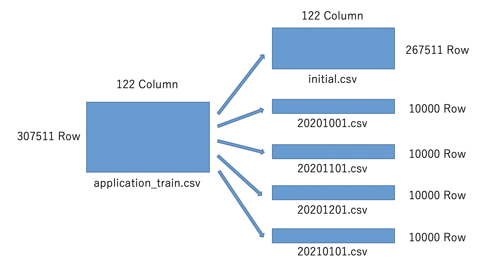

The actual code for splitting the data is shown below.

**split_data.ipynb**

```python
# load dataset
train = pd.read_csv('../data/rawdata/application_train.csv')

# output initial.csv
train.iloc[:len(train)-40000,:].to_csv('../data/poc/initial.csv', index=False)

# output data for each month
train.iloc[len(train)-40000:len(train)-30000,:].to_csv('../data/poc/20201001.csv', index=False)
train.iloc[len(train)-30000:len(train)-20000,:].to_csv('../data/poc/20201101.csv', index=False)
train.iloc[len(train)-20000:len(train)-10000,:].to_csv('../data/poc/20201201.csv', index=False)
train.iloc[len(train)-10000:,:].to_csv('../data/poc/20210101.csv', index=False)
```

### Situation to be considered

In this article, for ease of explanation, we will assume the following project. The following story is based on the author's imagination based on the data of "Home Credit Default Risk" used in this article, and has nothing to do with the actual company or business. The author is a complete novice in the field of credit operations and may differ greatly from actual operations.

---

As a data scientist, I am participating in a project to automate the credit approval process at a bank.
The credit judgment work is done manually by the screening department, but we are considering whether machine learning can be used to reduce man-hours and improve the accuracy of credit judgment.
Sample data has already been provided, and we are in the PoC stage. The sample data is a record of past loan defaults by borrowers. Based on this data, if someone wants to take out a new loan, we would like to be able to predict whether or not that person will default on the loan, so that we can decide whether or not to lend the loan.

### Scope of the project covered in this article

A machine learning project usually goes through planning, PoC, test operation, and production operation. In this article, in order to focus on the technical points, I will describe the scope from PoC to test operation. In particular, I will divide the test operation into three phases, since a lot of functions are required to move to production. Since the author has little experience in production operations, I only mentions the points that should be considered for production operations.

! [scope](. /images/scope.png)

### Structure assumed in this article

In this article, we will assume a minimal structure, as we are going to start the project small. Specifically, there will be one consultant who will communicate with the business department (in this article, the credit judgment department), and one data scientist who will perform everything from data analysis to system construction. In reality, there will be a manager as a supervisor, but they will not appear in this article. Also, as a stakeholder, there will be a business department.

! [organization](. /images/organization.png)

## PoC phase

## Purpose of this phase

The purpose of this phase is to verify whether it is feasible to automate credit decisions. In this phase, I will examine two main points: one is to validate the data otherwise whether the provided data can be used in production (e.g. whether the data can be used in forecasting or whether there is no relationship between records), and the other is to determine how accurately the credit judgment can be predicted by machine learning.

### Architecture in this phase

In this phase, we will work only with JupyterLab. MLflow is included for storing the machine learning models, but (in my opinion,) it is not necessary at the beginning.

! [architecture_poc](. /images/architecture_poc.png)

### Data Validation

If you are a data scientist, you want to start looking at the data right away, but first you need to validate the data. This is because if the data is flawed, any predictions made using the data will likely be useless. Validation involves checking two main points: first, for each record, when is the data available for each column in the record. The data for each column may seem to be available at the time it is provided to us, but that doesn't mean that they are available at the same time. In the simplest example, the objective variable "whether the debtor has defaulted" will be known later than the other columns. Another point to check is to see if there is any relationship between the records. For example, if a person applied for a loan twice and the first record in the training data and the second record in the test data, prediction will take an advantage in a bad way. In such a case, you can make sure that both records are included in either the training data or the test data. In addition to these points, it is also important to clarify the definition of the data by interviewing the business department about what each column means and what the unit of record is (in this data, is it per person or per loan application?). You may create a spreadsheet to check these checkpoints for each column of the data.

### Exploratory Data Analysis

Once the data has been validated (or in parallel with the validation), we can use [Jupyter Lab](https://github.com/jupyterlab/jupyterlab) to see what columns (features) are present by visualizing the sample data This process will help you understand the data and use it as a reference for feature engineering and model selection. It is also useful as a starting point to look for problems in the data.

First, for each column, we will check the data type, percentage of missing values, etc.

**eda.ipynb**

```python
"""
execution result of each code is shown below ">".
some execution results that may not be necessary
for the explanation are omitted with "..." or "omitted"
"""

# load library
import pandas as np

# load dataset
train = pd.read_csv('../../data/rawdata/application_train.csv')

# overview
train.head()
>
omitted

# number of rows/columns
f"Row:{len(train)} / Column:{len(train.columns)}"
>
'Row:307511 / Column:122'

# data type
train.dtypes
>
SK_ID_CURR                        int64
TARGET                            int64
NAME_CONTRACT_TYPE               object
...

# number of missing values and its ratio
for c in train.columns:
    print(f'{c}  num:{train[c].isnull().sum()} / ratio:{train[c].isnull().sum() / len(train) * 100:0.4f}%')
>
SK_ID_CURR  num:0 / ratio:0.0%
...
NAME_TYPE_SUITE  num:1292 / ratio:0.4201%
...
COMMONAREA_AVG  num:214865 / ratio:69.8723%
...
```

Next, to see the distribution, we will visualize it.
If the data type is numeric, we will use a histogram, and if the data type is string, we will use a bar chart.

**eda.ipynb**

```python
# load library
from bokeh.plotting import figure, output_file, show, output_notebook
from bokeh.models import ColumnDataSource, Grid, LinearAxis, Plot, VBar, HoverTool

# setting to output graphs on jupyter notebook
output_notebook()

# histogram
def plot_histogram(series, title, width=1000):
    p = figure(plot_width=width, plot_height=400, title=title, toolbar_location=None, tools="")
    hist, edges = np.histogram(series, density=True, bins=30)
    p.quad(
        top=hist,
        bottom=0,
        left=edges[:-1],
        right=edges[1:],
        fill_color="navy",
        alpha=0.2
    )
    p.y_range.start = 0
    show(p)

# bar chart
def plot_bar_chart(series, title, width=1000):
    items = dict(series.value_counts())
    keys = list(items.keys())
    values = list(items.values())
    source = ColumnDataSource(data=dict(
    x=keys,
    y=values,
    ))
    TOOLTIPS = [
    ("column name", "@x"),
    ("count", "@y"),
    ]
    p = figure(plot_width=width, plot_height=400, x_range=keys, title=title,
               toolbar_location=None, tooltips=TOOLTIPS, tools="")
    glyph = VBar(x="x", top="y", width=0.9)
    p.add_glyph(source, glyph)
    p.xgrid.grid_line_color = None
    p.y_range.start = 0
    show(p)

# output graph for each columns.Missig values are filled with '-999'
for c in train.columns:
    series = train[c].copy()
    if series.dtype == 'int64' or series.dtype == 'float64':
        series.fillna(-999, inplace=True)
        plot_histogram(series, c)
    else:
        series.fillna('-999', inplace=True)
        plot_bar_chart(series, c)
```

Two of the output graphs will be shown as examples. In fact, we should look at the distributions one by one, but we will skip that for now.

**AMT_CREDIT**

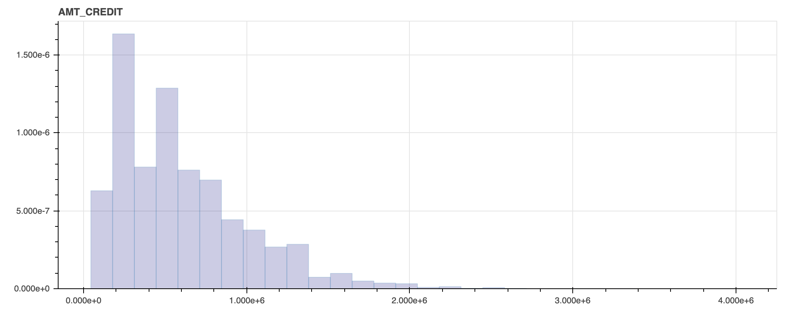

**NAME_INCOME_TYPE**

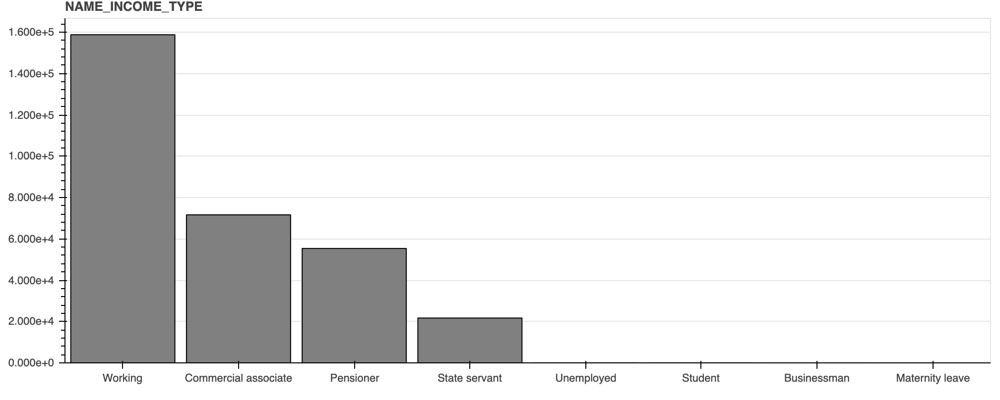

### Verification of prediction accuracy

From here, we will actually create the model and verify the prediction accuracy. In this case, we will use AUC of ROC, which is the same evaluation indicator used in "Home Credit Default Risk". In reality, we will discuss with the business department and agree in advance on which indicator to use. Before creating a prediction model manually, we will first try to make a quick prediction using [PyCaret](https://github.com/pycaret/pycaret). This will allow us to compare which features/models are effective and use them as a reference when actually creating the model.

**eda.ipynb**

```python
# load library
from pycaret.classification import *

# setup pycaret
exp = setup(data=train,
            target='TARGET',
            session_id=123,
            ignore_features = ['SK_ID_CURR'],
            log_experiment = True,
            experiment_name = 'credit1',
            n_jobs=-1,
            silent=True)
```

```python
# compare auc among models
models = compare_models(include=['lr', 'dt', 'rf', 'svm','lightgbm'],
                        sort='AUC')
```

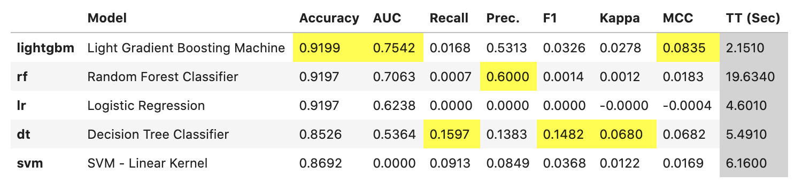

In this article, we will compare the following models provided by PyCaret.

- Logistic regression
- Decision Trees
- Random Forest
- SVM
- LightGBM

LightGBM seems to be superior when the evaluation metric is AUC. In general, LightGBM seems to be better in both accuracy and execution speed in most cases. By the way, recall is small in all models because of the imbalance data with few positive examples. Depending on your business goals, you may create a model with high recall score so that you prevents more bad debts. In this article, we will not do any more detailed modeling and will use LightGBM to build models.

Next, we will create and evaluate a LightGBM model in PyCaret to see which features are effective.

```python
# create lightgbm model
lgbm = create_model('lightgbm')
```

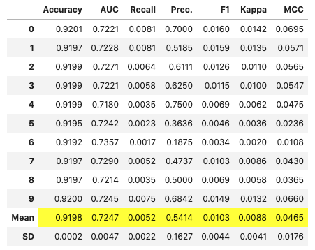

```python
# details of model
evaluate_model(lgbm)
```

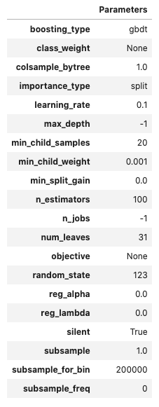

```python
# calculate shap importance
interpret_model(lgbm)
```

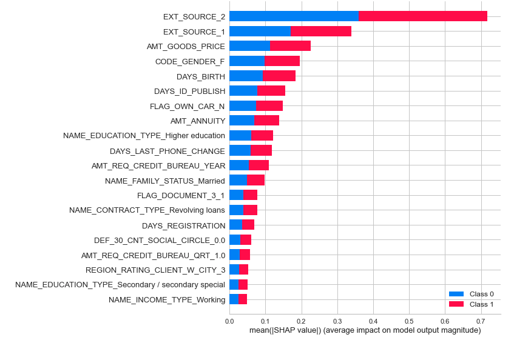

```python
# calculate importance
importance = pd.DataFrame(models.feature_importances_, index=exp[0].columns, columns=['importance'])
importance.sort_values('importance', ascending=False)
```

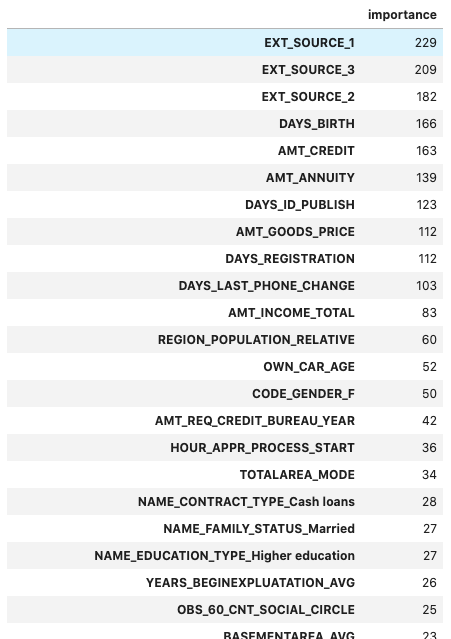

When there are a lot of features, as in the case of this data, reducing the number of the features will increase both accuracy and stability of the model. A simple way to do that is to calculate the feature importance and exclude the features with low importance. In this case, we will simply use the features with the highest importance. For the columns that are automatically preprocessed by PyCaret, we will use the original columns.

Now, we will create the prediction model manually.

#### Preprocessing

For the sake of simplicity, we will only complement the missing values in the preprocessing.

**forecast.ipynb**

```python
# fill missing values
train.fillna(-999, inplace=True)
```

#### Feature Engineering

Feature engineering involves feature selection and creating dummy variables of categorical features.

**forecast.ipynb**

```python
# feature selection
features = [
    'EXT_SOURCE_1',
    'EXT_SOURCE_3',
    'EXT_SOURCE_2',
    'DAYS_BIRTH',
    'AMT_CREDIT',
    'AMT_ANNUITY',
    'DAYS_ID_PUBLISH',
    'AMT_GOODS_PRICE',
    'DAYS_REGISTRATION',
    'DAYS_LAST_PHONE_CHANGE',
    'AMT_INCOME_TOTAL',
    'REGION_POPULATION_RELATIVE',
    'OWN_CAR_AGE',
    'AMT_REQ_CREDIT_BUREAU_YEAR',
    'HOUR_APPR_PROCESS_START',
    'TOTALAREA_MODE',
    'CODE_GENDER',
    'NAME_CONTRACT_TYPE',
    'NAME_EDUCATION_TYPE',
    'NAME_FAMILY_STATUS',
    'TARGET'
]
train = train.loc[:,features]

# create dummy variables
train = pd.get_dummies(train, drop_first=True, prefix=['CODE_GENDER', 'NAME_CONTRACT_TYPE', 'NAME_EDUCATION_TYPE', 'NAME_FAMILY_STATUS'], prefix_sep='_')
```

#### Prediction

Use LightGBM to create model. Also, use [Optuna](https://github.com/optuna/optuna) to tune hyperparameters.

```python
# split label and features
target = 'TARGET'
X = train.drop(columns=target)
y = train[target]

# split training data and test data
X_train, X_test, y_train, y_test = train_test_split(X, y,
                                                   test_size=0.2,
                                                   random_state=0,
                                                   stratify=y)

# split training data and validation data
X_train, X_eval, y_train, y_eval = train_test_split(X_train, y_train,
                                                    test_size=0.2,
                                                    random_state=1,
                                                    stratify=y_train)

# create dataset for lightgbm
categorical_features = []
lgb_train = lgb.Dataset(X_train, y_train,
                       categorical_feature=categorical_features,
                        free_raw_data=False)
lgb_eval = lgb.Dataset(X_eval, y_eval, reference=lgb_train,
                       categorical_feature=categorical_features,
                       free_raw_data=False)

# tune hyperparameters
def objective(trial):

    param = {
        'objective': 'binary',
        'metric': 'auc',
        'verbosity': -1,
        'n_jobs': -1,
        'boosting_type': 'gbdt',
        'lambda_l1': trial.suggest_loguniform('lambda_l1', 1e-8, 10.0),
        'lambda_l2': trial.suggest_loguniform('lambda_l2', 1e-8, 10.0),
        'num_leaves': trial.suggest_int('num_leaves', 2, 256),
        'feature_fraction': trial.suggest_uniform('feature_fraction', 0.4, 1.0),
        'bagging_fraction': trial.suggest_uniform('bagging_fraction', 0.4, 1.0),
        'bagging_freq': trial.suggest_int('bagging_freq', 1, 7),
        'min_child_samples': trial.suggest_int('min_child_samples', 5, 100),
    }

    evaluation_results = {}
    model = lgb.train(
        param,
        lgb_train,
        num_boost_round=1000,
        valid_names=['train', 'valid'],
        valid_sets=[lgb_train, lgb_eval],
        evals_result=evaluation_results,
        categorical_feature=categorical_features,
        early_stopping_rounds=50,
        verbose_eval=10)

    y_pred = model.predict(X_train, num_iteration=model.best_iteration)

    # metrics AUC
    fpr, tpr, thresholds = metrics.roc_curve(y_train, y_pred)
    score = metrics.auc(fpr, tpr)

    return score

# use optuna
study = optuna.create_study(direction='maximize')
study.optimize(objective, n_trials=10)

print('Number of finished trials: {}'.format(len(study.trials)))
print('Best trial:')
trial = study.best_trial
print('  Value: {}'.format(trial.value))
print('  Params: ')
for key, value in trial.params.items():
    print('    {}: {}'.format(key, value))
```

```python
# parameters for binary classification
params = {
            'boosting_type': 'gbdt',
            'objective': 'binary',
            'metric': 'auc',
         }
# concat parameters
params = dict(params, **study.best_params)

# learn model
evaluation_results = {}
model = lgb.train(
    param,
    lgb_train,
    num_boost_round=1000,
    valid_names=['train', 'valid'],
    valid_sets=[lgb_train, lgb_eval],
    evals_result=evaluation_results,
    categorical_feature=categorical_features,
    early_stopping_rounds=50,
    verbose_eval=10)

# save best_iteration
optimum_boost_rounds = model.best_iteration
```

```python
# evaluate training data
y_pred = model.predict(X_train, num_iteration=model.best_iteration)
fpr, tpr, thresholds = metrics.roc_curve(y_train, y_pred)
auc = metrics.auc(fpr, tpr)
print(auc)
plt.plot(fpr, tpr, label='ROC curve (area = %.2f)'%auc)
plt.legend()
plt.title('ROC curve')
plt.xlabel('False Positive Rate')
plt.ylabel('True Positive Rate')
plt.grid(True)
```

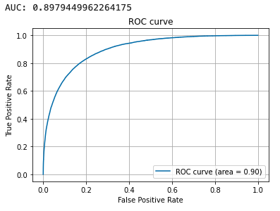

```python
# evaluate test data
y_pred = model.predict(X_test, num_iteration=model.best_iteration)
fpr, tpr, thresholds = metrics.roc_curve(y_test, y_pred)
auc = metrics.auc(fpr, tpr)
print(auc)
plt.plot(fpr, tpr, label='ROC curve (area = %.2f)'%auc)
plt.legend()
plt.title('ROC curve')
plt.xlabel('False Positive Rate')
plt.ylabel('True Positive Rate')
plt.grid(True)
```

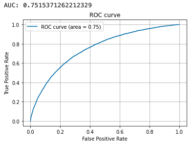

In this verification of the prediction accuracy, we were able to achieve almost the same accuracy using PyCaret. In reality, we will conduct more in-depth analysis based on these results, but this article ends with the verification of the PoC phase.

From here on, we will assume that the results of the PoC will be reported to the business department, and this project proceeds through PoC to production. However, the PoC will not suddenly go into production, and in fact, the system will be gradually brought closer to production through several test operations. Therefore, in the following, we will divide the test operation into three phases. In each phase, we will add functions little by little so that the operation will be gradually automated and get closer to the production operation.

### Supplement: Machine Learning Model Management

For managing machine learning models, [MLflow](https://github.com/mlflow/mlflow) is useful. It can manage models with each hyperparameters explored by Optuna, which will be useful as the number of model trials increases.

## Test Operation

## The three phases of test operations

Before we can go from PoC to production, we need to implement some features such as automation of operations and execution of inference alone. However, it would be difficult in terms of man-hours to implement all the necessary functions right away. (In addition, at this stage, you are probably being asked by the business department to further improve the accuracy.) Therefore, we will divide the necessary functions into three phases and implement them gradually, so that we can expand the functions as we operate. In each phase, we will implement the following functions respectively:

1. building data pipelines and semi-automating operations
2. Implemention of regular operation API
3. migration to the cloud and automation of operations

### Test Operation Phase 1: Building data pipeline and semi-automate operations.

#### Purpose of this phase

In this phase, we will partially automate the system created in the PoC. Before that, we will build a data pipeline by dividing and organizing the PoC program into blocks such as feature engineering and prediction. This will allow the training and inference to be executed in isolation or rerun from the middle. In addition, Airflow, a workflow engine, is introduced to enable automatic execution and scheduling execution of all programs divided into each block.

#### Architecture in this phase

In the PoC phase, we used a single Jupyter Notebook for preprocessing and prediction and so on, but from this phase, we will introduce two OSS to execute multiple Notebooks in order. The first is "[papermill](https://github.com/nteract/papermill)", an OSS that allows us to run Jupyter Notebooks from the command line with parameters so that we can make predictions for different months without rewriting notebooks. In addition, use "[Airflow](https://airflow.apache.org/)" to run each Notebook in order. This OSS provides not only automatic execution, but also scheduling execution, success and failure notifications, and other useful functions for operational automation.

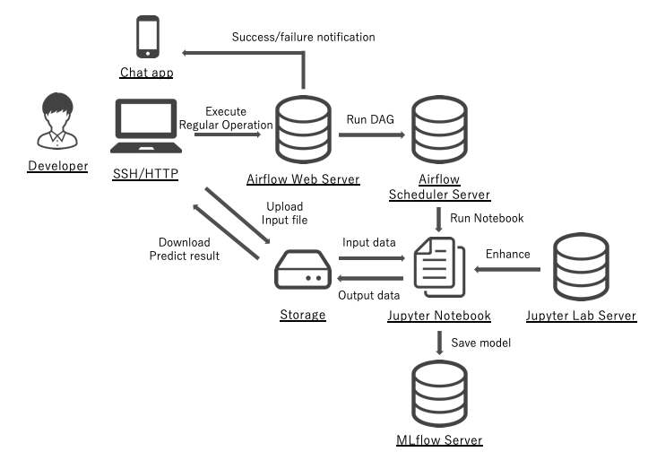

#### Data Pipeline

Divide the program created by PoC into four blocks: "data accumulation", "feature engineering", "learning" and "inference". When dividing the program into blocks, each block should be loosely coupled to each other by using data as an interface. This will limit the impact of changes in the program logic. For reference, here is an image of the data pipeline in this article. In each block, the month of execution is set to be passed as a parameter from papermill at the beginning of the program, so that it can be executed in a specific month.

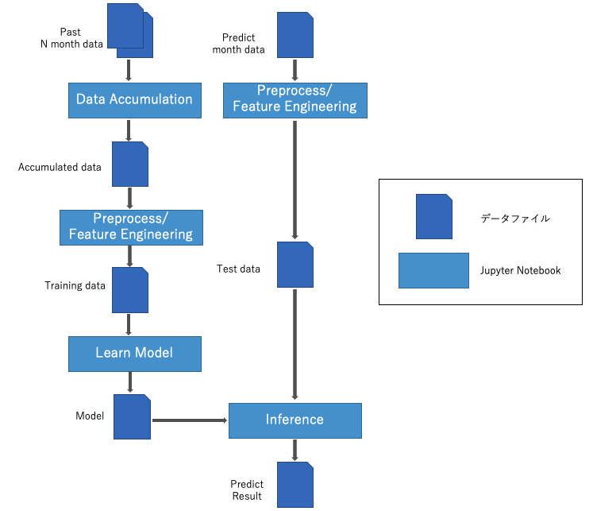

The following is the code for each block. Basically, it is a reuse of the program used in the PoC, with some additions and modifications for operational automation.

##### 1. Data accumulation

**accumulate.ipynb**

```python
# set operational parameter
TARGET_DATE = '20210101'
TARGET_DATE = str(TARGET_DATE)

# load library
import pandas as pd
from datetime import datetime
from dateutil.relativedelta import relativedelta

# load initial data
train = pd.read_csv('../../data/poc/initial.csv')

# load monthly data
INITIAL_DATE = '20201001'
date = datetime.strptime(INITIAL_DATE, '%Y%m%d')
target_date = datetime.strptime(TARGET_DATE, '%Y%m%d')

target_dates = []
while date < target_date:
    print(date)
    date_str = datetime.strftime(date, '%Y%m%d')
    target_dates.append(date_str)
    date += relativedelta(months=1)

# concat data
monthly_dataframes = [train]
for d in target_dates:
    df = pd.read_csv(f'../../data/poc/{d}.csv')
    monthly_dataframes.append(df)

train = pd.concat(monthly_dataframes, axis=0)

# output data
train.to_pickle(f'../../data/trial/accumulate_{TARGET_DATE}.pkl')
```

##### 2. Feature engineering

**feature_engineering.ipynb**

```python
# set operational parameters
TARGET_DATE = '20210101'
# DATA_TYPE = 'train'
DATA_TYPE = 'test'
TARGET_DATE = str(TARGET_DATE)

# load library
import pandas as pd

# load data
if DATA_TYPE == 'train':
    train = pd.read_pickle(f'../../data/trial/accumulate_{TARGET_DATE}.pkl')
elif DATA_TYPE == 'test':
    train = pd.read_csv(f'../../data/trial/{TARGET_DATE}.csv')

# feature selection
features = [
    'EXT_SOURCE_1',
    'EXT_SOURCE_3',
    'EXT_SOURCE_2',
    'DAYS_BIRTH',
    'AMT_CREDIT',
    'AMT_ANNUITY',
    'DAYS_ID_PUBLISH',
    'AMT_GOODS_PRICE',
    'DAYS_REGISTRATION',
    'DAYS_LAST_PHONE_CHANGE',
    'AMT_INCOME_TOTAL',
    'REGION_POPULATION_RELATIVE',
    'OWN_CAR_AGE',
    'AMT_REQ_CREDIT_BUREAU_YEAR',
    'HOUR_APPR_PROCESS_START',
    'TOTALAREA_MODE',
    'CODE_GENDER',
    'NAME_CONTRACT_TYPE',
    'NAME_EDUCATION_TYPE',
    'NAME_FAMILY_STATUS',
    'TARGET'
]
train = train.loc[:,features]

# fill missing values
# fill with NAN in case data type is object and -999 in case that is numerical
for c in train.columns:
    if train[c].dtype == 'object':
        train[c].fillna('NAN', inplace=True)
    else:
        train[c].fillna(-999, inplace=True)

# create dummy variables
train = pd.get_dummies(train, drop_first=True, prefix=['CODE_GENDER', 'NAME_CONTRACT_TYPE', 'NAME_EDUCATION_TYPE', 'NAME_FAMILY_STATUS'], prefix_sep='_')

# create if there are missing columns
feature_order = [
    'EXT_SOURCE_1',
    'EXT_SOURCE_3',
    'EXT_SOURCE_2',
    'DAYS_BIRTH',
    'AMT_CREDIT',
    'AMT_ANNUITY',
    'DAYS_ID_PUBLISH',
    'AMT_GOODS_PRICE',
    'DAYS_REGISTRATION',
    'DAYS_LAST_PHONE_CHANGE',
    'AMT_INCOME_TOTAL',
    'REGION_POPULATION_RELATIVE',
    'OWN_CAR_AGE',
    'AMT_REQ_CREDIT_BUREAU_YEAR',
    'HOUR_APPR_PROCESS_START',
    'TOTALAREA_MODE',
    'CODE_GENDER_M',
    'CODE_GENDER_XNA',
    'NAME_CONTRACT_TYPE_Revolving loans',
    'NAME_EDUCATION_TYPE_Higher education',
    'NAME_EDUCATION_TYPE_Incomplete higher',
    'NAME_EDUCATION_TYPE_Lower secondary',
    'NAME_EDUCATION_TYPE_Secondary / secondary special',
    'NAME_FAMILY_STATUS_Married',
    'NAME_FAMILY_STATUS_Separated',
    'NAME_FAMILY_STATUS_Single / not married',
    'NAME_FAMILY_STATUS_Unknown',
    'NAME_FAMILY_STATUS_Widow',
    'TARGET',
]
for c in feature_order:
    if c not in train.columns:
        train[c] = 0

# sort columns
train = train.loc[:, feature_order]

# output data
if DATA_TYPE == 'train':
    train.to_pickle(f'../../data/trial/feature_{TARGET_DATE}.pkl')
elif DATA_TYPE == 'test':
    train.to_pickle(f'../../data/trial/predict_{TARGET_DATE}.pkl')
```

##### 3. Learn model

**learn.ipynb**

```python
# set operational parameters
TARGET_DATE = '20210101'
TARGET_DATE = str(TARGET_DATE)

# load library
import pandas as pd
import numpy as np
import argparse
import shap
import optuna
import pickle
import lightgbm as lgb
from sklearn.metrics import accuracy_score, confusion_matrix, recall_score, f1_score, precision_score
from sklearn.model_selection import train_test_split
from sklearn import datasets
from sklearn import metrics
from sklearn.model_selection import StratifiedKFold
import matplotlib.pyplot as plt

# load data
train = pd.read_pickle(f'../../data/trial/feature_{TARGET_DATE}.pkl')

# separete label with features
target = 'TARGET'
X = train.drop(columns=target)
y = train[target]

# split training data and test data
X_train, X_test, y_train, y_test = train_test_split(X, y,
                                                   test_size=0.2,
                                                   random_state=0,
                                                   stratify=y)

# split training data and validation data
X_train, X_eval, y_train, y_eval = train_test_split(X_train, y_train,
                                                    test_size=0.2,
                                                    random_state=1,
                                                    stratify=y_train)

# create dataset for lightgbm
categorical_features = []
lgb_train = lgb.Dataset(X_train, y_train,
                       categorical_feature=categorical_features,
                        free_raw_data=False)
lgb_eval = lgb.Dataset(X_eval, y_eval, reference=lgb_train,
                       categorical_feature=categorical_features,
                       free_raw_data=False)

# tune hyperparameters
def objective(trial):

    param = {
        'objective': 'binary',
        'metric': 'auc',
        'verbosity': -1,
        'n_jobs': -1,
        'boosting_type': 'gbdt',
        'lambda_l1': trial.suggest_loguniform('lambda_l1', 1e-8, 10.0),
        'lambda_l2': trial.suggest_loguniform('lambda_l2', 1e-8, 10.0),
        'num_leaves': trial.suggest_int('num_leaves', 2, 256),
        'feature_fraction': trial.suggest_uniform('feature_fraction', 0.4, 1.0),
        'bagging_fraction': trial.suggest_uniform('bagging_fraction', 0.4, 1.0),
        'bagging_freq': trial.suggest_int('bagging_freq', 1, 7),
        'min_child_samples': trial.suggest_int('min_child_samples', 5, 100),
    }

    evaluation_results = {}
    model = lgb.train(
        param,
        lgb_train,
        num_boost_round=1000,
        valid_names=['train', 'valid'],
        valid_sets=[lgb_train, lgb_eval],
        evals_result=evaluation_results,
        categorical_feature=categorical_features,
        early_stopping_rounds=50,
        verbose_eval=10)

    y_pred = model.predict(X_train, num_iteration=model.best_iteration)

    # metrics AUC
    fpr, tpr, thresholds = metrics.roc_curve(y_train, y_pred)
    score = metrics.auc(fpr, tpr)

    return score

# use optuna
study = optuna.create_study(direction='maximize')
study.optimize(objective, n_trials=10)

print('Number of finished trials: {}'.format(len(study.trials)))
print('Best trial:')
trial = study.best_trial
print('  Value: {}'.format(trial.value))
print('  Params: ')
for key, value in trial.params.items():
    print('    {}: {}'.format(key, value))

# parameters for binary classification
params = {
            'boosting_type': 'gbdt',
            'objective': 'binary',
            'metric': 'auc',
         }
# concat parameters
params = dict(params, **study.best_params)

# learn model
evaluation_results = {}
model = lgb.train(
    param,
    lgb_train,
    num_boost_round=1000,
    valid_names=['train', 'valid'],
    valid_sets=[lgb_train, lgb_eval],
    evals_result=evaluation_results,
    categorical_feature=categorical_features,
    early_stopping_rounds=50,
    verbose_eval=10)

# save best_iteration
optimum_boost_rounds = model.best_iteration

# evaluate training data
y_pred = model.predict(X_train, num_iteration=model.best_iteration)
fpr, tpr, thresholds = metrics.roc_curve(y_train, y_pred)
auc = metrics.auc(fpr, tpr)
print(auc)
plt.plot(fpr, tpr, label='ROC curve (area = %.2f)'%auc)
plt.legend()
plt.title('ROC curve')
plt.xlabel('False Positive Rate')
plt.ylabel('True Positive Rate')
plt.grid(True)

# evaluate test data
y_pred = model.predict(X_test, num_iteration=model.best_iteration)
fpr, tpr, thresholds = metrics.roc_curve(y_test, y_pred)
auc = metrics.auc(fpr, tpr)
print(auc)
plt.plot(fpr, tpr, label='ROC curve (area = %.2f)'%auc)
plt.legend()
plt.title('ROC curve')
plt.xlabel('False Positive Rate')
plt.ylabel('True Positive Rate')
plt.grid(True)

# output model
pickle.dump(model, open(f'../../data/trial/model_{TARGET_DATE}.pkl', 'wb'))
```

##### 4. Inference

**inference.ipynb**

```python
# setup parameters
TARGET_DATE = '20210101'
TARGET_DATE = str(TARGET_DATE)

# load library
import pandas as pd
import numpy as np
import pickle
import lightgbm as lgb

# load data
test = pd.read_pickle(f'../../data/trial/predict_{TARGET_DATE}.pkl')

# load model
model = pickle.load(open(f'../../data/trial/model_{TARGET_DATE}.pkl', 'rb'))

# predict
test.drop(columns=['TARGET'], inplace=True)
y_pred = model.predict(test, num_iteration=model.best_iteration)
y_pred_max = np.round(y_pred)

# create result data
pred = pd.DataFrame()
# load id
rawdata = pd.read_csv(f'../../data/trial/{TARGET_DATE}.csv')
pred['ID'] = rawdata['SK_ID_CURR']
pred['TARGET'] = y_pred_max

# output result
pred.to_csv(f'../../data/trial/pred_{TARGET_DATE}.csv', index=None)
```

#### Semi-automating operations.

Once each process has been split into individual programs, Airflow can be used to execute them in an ordered manner. By passing the forecasted month as a parameter at runtime, we can run for each month. Also, if you want to schedule the execution, you can define the date and time of the scheduling execution as a cron expression in "schedule_interval". The Airflow code is shown below.

**trial_operation.py**

```python
from datetime import timedelta
from airflow import DAG
from airflow.operators.bash import BashOperator
from airflow.utils.dates import days_ago

args = {
    "owner": "admin",
}


dag = DAG(
    dag_id="trial_operation",
    default_args=args,
    schedule_interval=None, # define by cron expression like "0 0 0 * *" if you want to schedule the execution
    start_date=days_ago(2),
    dagrun_timeout=timedelta(minutes=60),
    # tags=[],
    params={
        "target_date": "20210101",
        "work_dir": "~/Code/between_poc_and_production/notebooks/trial/",
    },
)

accumulate = BashOperator(
    task_id="accumulate_train_data",
    bash_command="papermill --cwd {{ dag_run.conf['work_dir'] }} {{ dag_run.conf['work_dir'] }}accmulate.ipynb {{ dag_run.conf['work_dir'] }}logs/accmulate.ipynb -p TARGET_DATE {{ dag_run.conf['target_date'] }}",
    dag=dag,
)

feat_eng_train = BashOperator(
    task_id="feature_engineering_train_data",
    bash_command="papermill --cwd {{ dag_run.conf['work_dir'] }} {{ dag_run.conf['work_dir'] }}feature_engineering.ipynb {{ dag_run.conf['work_dir'] }}logs/feature_engineering.ipynb -p TARGET_DATE {{ dag_run.conf['target_date'] }} -p DATA_TYPE train",
    dag=dag,
)

feat_eng_test = BashOperator(
    task_id="feature_engineering_test_data",
    bash_command="papermill --cwd {{ dag_run.conf['work_dir'] }} {{ dag_run.conf['work_dir'] }}feature_engineering.ipynb {{ dag_run.conf['work_dir'] }}logs/feature_engineering.ipynb -p TARGET_DATE {{ dag_run.conf['target_date'] }} -p DATA_TYPE test",
    dag=dag,
)

learn = BashOperator(
    task_id="learn",
    bash_command="papermill --cwd {{ dag_run.conf['work_dir'] }} {{ dag_run.conf['work_dir'] }}learn.ipynb {{ dag_run.conf['work_dir'] }}logs/learn.ipynb -p TARGET_DATE {{ dag_run.conf['target_date'] }}",
    dag=dag,
)

inference = BashOperator(
    task_id="inference",
    bash_command="papermill --cwd {{ dag_run.conf['work_dir'] }} {{ dag_run.conf['work_dir'] }}inference.ipynb {{ dag_run.conf['work_dir'] }}logs/inference.ipynb -p TARGET_DATE {{ dag_run.conf['target_date'] }}",
    dag=dag,
)

accumulate >> feat_eng_train >> learn

[learn, feat_eng_test] >> inference

if __name__ == "__main__":
    dag.cli()

```

You can view your defined workflow as a flowchart in Airflow. For example, the above code can be visualized as following figure. You can see that this diagram has the same structure as the data pipeline we defined earlier. (In the figure, each box is green (execution complete successfully) because the prediction has been executed once.)

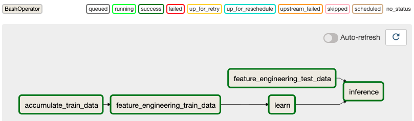

With the implementation of test operation phase 1, we were able to automate the monthly operations as shown below, and we can see that the parts that were done manually in PoC have been greatly automated.

- PoC Phase
  1. upload data for the forecast month
  2. Combine training data of previous months
  3. Preprocessing and feature engineering of training data
  4. Train model from training data
  5. Preprocess test data and do feature engineering
  6. Predict the test data using the trained model
  7. download the prediction result
- Test Operation Phase 1
  1. Upload the data for the forecast month
     Run the Workflow from Airflow
     Download the prediction result

### Test Operation Phase 2: Implementation of regular operation API.

#### Purpose of this phase

In phase 1, we were able to greatly automate monthly operations by dividing functions such as preprocessing and inference into separate programs and execute in order by combining papermill and Airflow. In this phase 2, we will further automate the process. Specifically, we will prepare APIs and GUI screens to execute data upload/download and regular operations, which were done manually in Phase 1. In this way, even non-engineering users such as consultant s and business departments will be able to operate the system easily. In this way, the regular operations can be left to the users, and the engineers can concentrate more on the development tasks.

#### Architecture in this phase

In phase 2, we will build a web server and create a GUI screen to operate it.

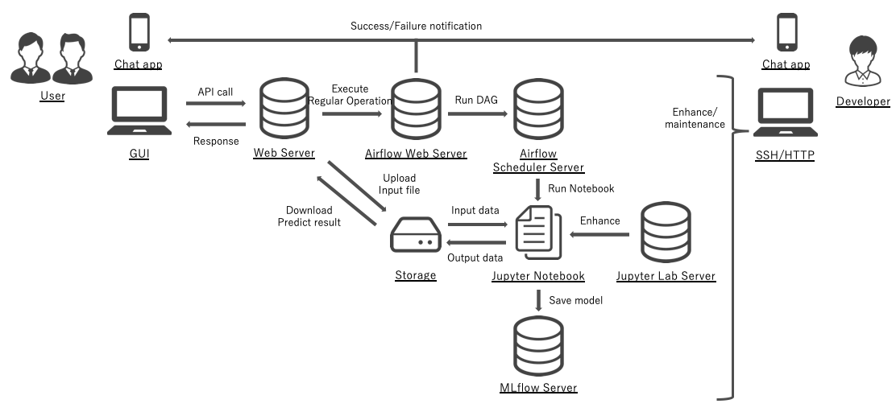

#### Creating a Web Server

Prepare the following APIs for the web server.

- Upload function for input files
- Execution of regular operations
- Download function of forecast files

This time, we will use [FastAPI](https://github.com/tiangolo/fastapi) to create the web server.

**server.py**

```python
from fastapi import FastAPI, File, UploadFile
import os
import shutil
from fastapi.middleware.cors import CORSMiddleware
from pydantic import BaseModel
from fastapi.responses import FileResponse
from airflow.api.client.local_client import Client


ALLOWED_EXTENSIONS = set(["csv"])
UPLOAD_FOLDER = "./upload"
DOWNLOAD_FOLDER = "./download/"

app = FastAPI()

origins = [
    "http://localhost",
    "http://localhost:3000",
]

app.add_middleware(
    CORSMiddleware,
    allow_origins=origins,
    allow_credentials=True,
    allow_methods=["*"],
    allow_headers=["*"],
)


class PredictParam(BaseModel):
    target_date: str


def allowed_file(filename):
    return "." in filename and filename.rsplit(".", 1)[1].lower() in ALLOWED_EXTENSIONS


@app.post("/api/v1/upload-trial-input")
async def upload(file: UploadFile = File(...)):
    if file and allowed_file(file.filename):
        filename = file.filename
        fileobj = file.file
        upload_dir = open(os.path.join(UPLOAD_FOLDER, filename), "wb+")
        shutil.copyfileobj(fileobj, upload_dir)
        upload_dir.close()
        return {"result": "Success", "message": f"successfully uploaded: {filename}"}
    if file and not allowed_file(file.filename):
        return {
            "result": "Failed",
            "message": "file is not uploaded or extension is not allowed",
        }


@app.post("/api/v1/execute-trial-operation")
async def execute(param: PredictParam):
    try:
        c = Client(None, None)
        c.trigger_dag(
            dag_id="trial_operation",
            conf={
                "target_date": param.target_date,
                "work_dir": "~/Code/between_poc_and_production/notebooks/trial/",
            },
        )
        return {"result": "Success", "message": "successfully triggered"}
    except Exception as e:
        return {"result": "Failed", "message": f"error occured: {e}"}


@app.get("/api/v1/download-trial-output")
async def download():
    return FileResponse(
        DOWNLOAD_FOLDER + "pred_20210101.csv",
        filename="pred_20210101.csv",
        media_type="text/csv",
    )


```

#### Creating the GUI screen

For the GUI, we need a button to execute the web server API and a form to upload data. In this case, I used [React](https://github.com/facebook/react) and [Typescript](https://github.com/microsoft/TypeScript) to create the GUI on my own, but it may be faster to use a library that creates the screen itself, such as [streamlit](https://github.com/streamlit/streamlit).

**App.tsx**

```javascript
import React from 'react';
import { useState } from 'react';
import './App.css';
import { makeStyles, createStyles, Theme } from '@material-ui/core/styles';
import {
  Toolbar,
  Button,
  AppBar,
  TextField,
  Divider,
  Input,
  Typography,
} from '@material-ui/core';

const useStyles = makeStyles((theme: Theme) =>
  createStyles({
    root: {
      '& > *': {
        margin: theme.spacing(1),
      },
    },
    titleText: {
      paddingTop: '15px',
      paddingLeft: '15px',
    },
    dateForm: {
      paddingTop: '10px',
      paddingLeft: '15px',
    },
    fileForm: {
      paddingLeft: '15px',
      paddingBottom: '10px',
    },
    button: {
      paddingLeft: '15px',
    },
  })
);

const App: React.FC = () => {
  const classes = useStyles();
  const [selectedFile, setSelectedFile] = useState<unknown | null>();
  const [executeDate, setExecuteDate] = useState('20210101');

  const changeHandler = (event: any) => {
    setSelectedFile(event.target.files[0]);
  };

  const handelExecuteDate = (event: any) => {
    setExecuteDate(event.target.value);
  };

  const handleSubmission = () => {
    const formData = new FormData();
    formData.append('file', selectedFile as string);

    fetch('http://localhost:8000/api/v1/upload-trial-input', {
      method: 'POST',
      body: formData,
    })
      .then((response) => response.json())
      .then((result) => {
        console.log(result);
      });
  };

  async function postData(url = '', data = {}) {
    const response = await fetch(url, {
      method: 'POST',
      mode: 'cors',
      headers: {
        'Content-Type': 'application/json',
      },
      body: JSON.stringify(data),
    });
    return response.json();
  }

  return (
    <>
      <div className='App'>
        <AppBar position='static'>
          <Toolbar variant='dense'>
            <Typography variant='h6' color='inherit'>
              Between PoC and Production
            </Typography>
          </Toolbar>
        </AppBar>
      </div>
      <Typography variant='h5' gutterBottom className={classes.titleText}>
        Regular Operation
      </Typography>
      <Divider variant='middle' />
      <Typography variant='subtitle1' className={classes.titleText}>
        Input execution date
      </Typography>
      <div className={classes.dateForm}>
        <form noValidate autoComplete='off'>
          <TextField
            required
            id='standard-basic'
            value={executeDate}
            label='YYYYMMDD'
            InputLabelProps={{ shrink: true }}
            variant='outlined'
            onChange={handelExecuteDate}
          />
        </form>
      </div>
      <Typography variant='subtitle1' className={classes.titleText}>
        Upload input file
      </Typography>
      <div className={classes.fileForm}>
        <Input type='file' onChange={changeHandler} color='primary' />
      </div>
      <div className={classes.button}>
        <Button onClick={handleSubmission} variant='contained' color='primary'>
          Upload
        </Button>
      </div>
      <Typography variant='subtitle1' className={classes.titleText}>
        Execute Regular Operation
      </Typography>
      <div className={classes.button}>
        <Button
          onClick={() =>
            postData('http://localhost:8000/api/v1/execute-trial-operation', {
              target_date: executeDate,
            }).then((result) => {
              console.log(result);
            })
          }
          variant='contained'
          color='primary'
        >
          Execute
        </Button>
      </div>
      <Typography variant='subtitle1' className={classes.titleText}>
        Download Predict file
      </Typography>
      <div className={classes.button}>
        <Button
          variant='contained'
          color='primary'
          href='http://localhost:8000/api/v1/download'
        >
          Download
        </Button>
      </div>
    </>
  );
};

export default App;

```

GUI screen is like following image.

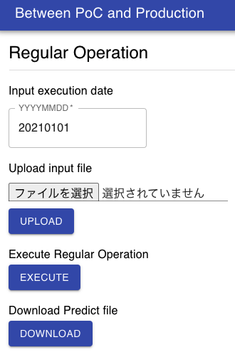

### Test Operation Phase 3: Migration to the Cloud and Operational Automation

#### Purpose of this phase

In Phase 3, we will move servers to the cloud and move some functions to managed services in order to further automate regular operations. The purpose of using the cloud is to increase the availability of the system by delegating operations such as infrastructure to the cloud, so that we can focus on enhancing and maintaining the application.The basic functions are common to all the clouds such as AWS, GCP, and Azure, but each of them has different features and characteristics, so I think it is better to compare them.

In this article, I will briefly examine migration to AWS as an example. There are two migration examples: Pattern 1, in which the system created up in the test operation phase 2 is migrated simply to AWS, and Pattern 2, in which further automation is performed.

#### Architecture Pattern 1 with AWS (Amazon Web Service): Simple EC2-only configuration

Each server is built on EC2, and data is stored in EBS. The usage is almost the same as local linux machine and migration should not be difficult. However, uploading of input data and downloading of prediction results still needs to be done manually. Also, since each function of the system is just running on EC2, the ease of enhancement and maintenance has not changed much.

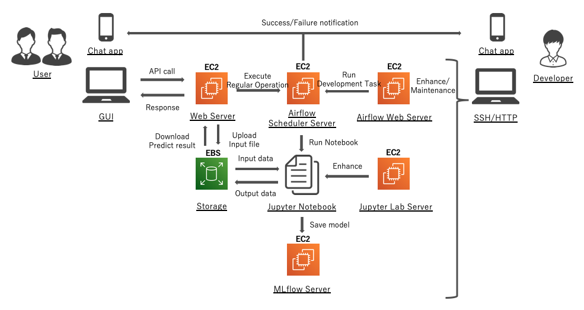

#### Architecture Pattern 2 on AWS (Amazon Web Service): Further Automated Configuration

In this pattern 2, the following points that were issues in pattern 1 are improved.

- Automation of data input/output
- Splitting some functions into individual programs and managed services

First, to automate data input/output, we use S3 as a shared folder for exchange data with external systems. Monitor data input/output to S3 using CloudWatch and CloudTrail, and call Airflow's regular operation API using Lambda. And then, we can run the prediction system by triggering the storage of input files. With this system, there is no need to set up a GUI or a web server. If you set up a web server in the cloud, you will need authentication functions and vulnerability countermeasures, so this will also reduce these risks.

As for splitting some of the functions into individual programs and services, we did the following points.

- Changed the storage location of input/output files to S3
- Moved the trigger program for system execution to Lambda
- Migrated the success/failure notification program to Lambda and SNS

The scope that we were able to divide up this time is not very wide, but I think we can divide up the program further by using other AWS services to make it easier to enhance and maintain. However, if you expand the scope too much, you may end up with vendor lock-in, so you need to consider the ease of migration as well.

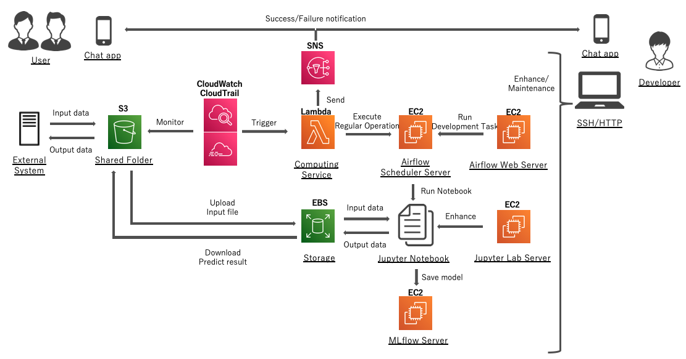

We have now completed all considerations up to test operation phase 3. Actually, there are many technical and business hurdles in running an on-demand analysis service of PoC regularly as production, but I hope that the methods we discussed here will be helpful.

## Additional things to consider for production operations

Finally, in the following chapter, we will list things to consider for production operations.

#### Utilizing the Cloud

In test operation phase 3, we migrated to the cloud. Since the cloud has a variety of other functions, it is best to utilize them to the extent that they do not significantly sacrifice portability. For example, data governance can be introduced by linking the internal authentication function with the cloud authentication function, and the auto-scaling function can be used to handle larger scale data.

It is also important to eliminate as much of your own code as possible and move to managed services. Considering the long-term operation of the system, you should consider utilizing a service with similar functions if available, since your own code is not easy to maintain and is also very impersonal. For example, for Airflow, there are managed services such as GCP's "Cloud Composer" and AWS's "Amazon Managed Workflows for Apache Airflow", so using these services is something to consider.

#### Program Reusability

While Jupyter Notebook is easy and convenient for development, it is not easy to manage, run, and test with git. It may be a good idea to migrate to python files as needed, depending on the combination of development speed and quality. Also, if this system itself can be built on Docker and Kubernetes, it will not only increase the robustness of the system and make it easier to scale the process, but it will also have great business benefits such as making it easier to expand to other projects.

#### Data storing

In this article, data was stored in CSV or Pickle format, but it is good to consider which data to be stored in which format. For this purpose, it is useful to manage the definitions of each data in a spreadsheet when the data pipeline is developed. I often use CSV for data that is difficult to recreate (input data) or data that requires external collaboration (forecast results), and Pickle format for intermediate-generated data. Pickle format is convenient, but it is not versatile or robust, so it is better to define the data type separately and supplement it with CSV, or use "Parquet" if you have the knowledge.

#### Data monitoring

In order to continuously operate a machine learning system, you need to pay attention to the data as well as the system. For example, if the trend of the input data changes, it may have a significant impact on the prediction accuracy even if there is no problem with the system. Therefore, it is necessary to monitor the input data, for example, to check if the distribution of data in each column and the relationship with the labels have changed. Also, depending on the system you are creating, you need to verify the fairness of the predictions, for example, whether the prediction results vary depending on gender.

#### Data governance

At the PoC level, access privileges to data will be naturally limited, but as the operation becomes longer and the number of people involved in the system increases, it will become necessary to set appropriate access privileges for each data. In such cases, it is best to utilize the authentication functions of cloud services. For example, by creating individual accounts with AWS IAM, you can flexibly set access privileges to the data stored in S3 according to each individual's department or position. In addition, since cloud services have functions that can be integrated with internal authentication infrastructure, it is also a good idea to utilize these services.

#### Software used in this article and its version

The source of the system built as an example in this article is stored in the following GitHub repository.

https://github.com/koyaaarr/between_poc_and_production

The versions of the main software used are as follows.

| Software   | Version |
| ---------- | ------- |
| JupyterLab | 2.1.5   |
| Airflow    | 2.0.0   |
| MLflow     | 1.13.1  |
| papermill  | 2.2.2   |
| FastAPI    | 0.63.0  |
| React      | 17.0.1  |
| Typescript | 4.1.3   |
| PyCaret    | 2.2.3   |
| pandas     | 1.1.4   |
| Bokeh      | 2.2.3   |

## Reference

#### About how to handle machine learning project

- データ分析・AI のビジネス導入 (https://www.amazon.co.jp/dp/4627854110)
- 仕事ではじめる機械学習 (https://www.amazon.co.jp/dp/4873118255)

#### About how to build predictive model

- 前処理大全 (https://www.amazon.co.jp/dp/4774196479)
- Kaggle で勝つデータ分析の技術 (https://www.amazon.co.jp/dp/4297108437)
- 機械学習のための特徴量エンジニアリング (https://www.amazon.co.jp/dp/4873118689)

#### About user interface

- Material UI (https://material-ui.com/)

#### About how to architect machine learning system

- Beyond Interactive: Notebook Innovation at Netflix (https://netflixtechblog.com/notebook-innovation-591ee3221233)
- Airflow を用いたデータフロー分散処理 (https://analytics.livesense.co.jp/entry/2018/02/06/132842)
- Jupyter だけで機械学習を実サービス展開できる基盤 (https://engineer.recruit-lifestyle.co.jp/techblog/2018-10-04-ml-platform/)

